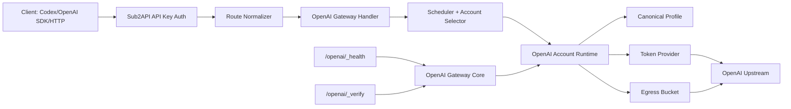

# OpenAI Gateway v0.3 Alignment Design

Date: 2026-05-06

Branch: `codex/openai-gateway-v03-design`

Baseline: local `sub2api/main` at `ccd2739f`

## 1. Purpose

This document designs the next OpenAI Gateway workstream for `sub2api`.

The goal is not to replace the existing OpenAI Gateway implementation. The current codebase already contains substantial OpenAI Gateway capability: OpenAI OAuth import and refresh, `/openai/v1/*` explicit gateway routes, `/openai/_health`, `/openai/_verify`, account scheduling, Responses HTTP, Responses WebSocket, Chat Completions, Images, canonical client profile handling, and per-account egress bucket resolution.

The goal of this workstream is to align those existing capabilities with the v0.3 governance model that was just applied to Anthropic / Antigravity through `cc-gateway`, while keeping OpenAI-specific behavior independent.

## 2. Executive Decision

Proceed with OpenAI Gateway as a separate backend-first workstream.

Recommended scope:

- No frontend work in this phase.
- No rewrite of the existing OpenAI Gateway.
- No dependency on the missing Anthropic OAuth account.
- Use real GPT/OpenAI OAuth accounts as the preferred upstream credential model.
- Treat API-key upstream mode as supported compatibility, but not the safest primary operating mode.
- Tighten the existing backend gateway around security boundaries, observability, egress binding, route contract, live verification, and deployment runbooks.

The key safety argument for GPT/OpenAI OAuth is architectural: clients never receive upstream OpenAI credentials. They authenticate to `sub2api` with Sub2API API keys; the server owns upstream OAuth tokens, refreshes them, schedules accounts, applies egress policy, and strips or normalizes client-facing request details before reaching OpenAI.

That does not make OAuth risk-free. It moves the most sensitive asset to the server: refresh tokens. Therefore this design requires token storage, log redaction, admin access, backup handling, and operational verification to be treated as high-risk surfaces.

## 3. Current Reality In The Codebase

### 3.1 Existing routes

The local `main` branch already exposes OpenAI Gateway routes in `backend/internal/server/routes/gateway.go`:

- `/openai/v1/responses`
- `/openai/v1/chat/completions`
- `/openai/v1/images/generations`
- `/openai/v1/images/edits`
- `/openai/_health`
- `/openai/_verify`

It also has compatibility routes under:

- `/v1/responses`
- `/responses`
- `/backend-api/codex/responses`
- `/v1/chat/completions`
- `/chat/completions`
- `/v1/images/*`
- `/images/*`

Those compatibility routes auto-route to OpenAI Gateway only when the authenticated Sub2API API key belongs to an OpenAI group.

### 3.2 Existing core configuration

The code already has `gateway.openai_core`:

- `enabled`
- `default_profile_mode`
- `default_egress_bucket`
- `probe_require_client_token`
- canonical `User-Agent`
- canonical `X-Stainless-*` headers
- `egress_buckets`
- `client_tokens`

The code already has `gateway.openai_ws`:

- HTTP / WebSocket feature flags
- OAuth and API-key WS enablement
- connection pool sizing
- first-message/read/write timeouts
- retry budget
- scheduler score weights
- sticky session / response ID TTLs
- metadata bridge options
- fallback controls

### 3.3 Existing account runtime model

`OpenAIGatewayCoreService` already resolves:

- client identity from `X-OpenAI-Gateway-Token`
- account canonical profile
- account egress bucket from `account.extra.openai_gateway_egress_bucket`
- bucket proxy URL from `gateway.openai_core.egress_buckets`
- health snapshot
- verify snapshot
- admin status snapshot

It also rewrites `metadata.user_id` to include gateway profile identity.

### 3.4 Existing OAuth model

The current OpenAI OAuth implementation uses:

- OpenAI auth endpoint: `https://auth.openai.com/oauth/authorize`
- OpenAI token endpoint: `https://auth.openai.com/oauth/token`
- PKCE
- refresh token flow
- default scopes: `openid profile email offline_access`
- a Codex-compatible client ID and simplified flow flag

`OpenAITokenProvider` already caches and refreshes access tokens, supports lock contention handling, and exposes runtime refresh metrics.

### 3.5 Existing official API boundary

OpenAI's public API examples use `Authorization: Bearer ...` for Responses API calls. OpenAI's Realtime WebSocket documentation also requires an authentication header for WebSocket connections and documents `Authorization: Bearer YOUR_API_KEY` for server-side WebSocket clients.

For our gateway, this means the upstream boundary should remain simple:

- The external client uses a Sub2API API key against `sub2api`.
- The gateway selects an OpenAI upstream account.
- The gateway injects the selected upstream OpenAI credential.
- The gateway must not pass the client Sub2API credential upstream.

Official references:

- Responses API example with bearer auth: https://developers.openai.com/api/docs/guides/prompting#create-a-prompt
- Realtime WebSocket auth header guidance: https://developers.openai.com/api/docs/guides/realtime-websocket#connect-via-websocket

## 4. Design Principles

### 4.1 Keep OpenAI Gateway independent from cc-gateway

OpenAI Gateway should align with the v0.3 governance model, not depend on `cc-gateway`.

`cc-gateway` is the Anthropic / Antigravity identity rewriting boundary. OpenAI Gateway is already inside `sub2api`, and it has different protocols, credentials, profile fields, and scheduling needs.

Do not introduce `x-cc-*` semantics into OpenAI Gateway.

### 4.2 Prefer server-side GPT/OpenAI OAuth

The primary deployment model should be:

```text
Client -> Sub2API API Key -> sub2api OpenAI Gateway -> selected GPT/OpenAI OAuth account -> OpenAI upstream
```

This is safer than distributing upstream OpenAI API keys because:

- upstream credentials are never exposed to external clients;
- client revocation is handled by Sub2API API keys, not upstream credentials;
- account scheduling, quota isolation, egress binding, and health checks stay server-side;
- refresh is centralized and observable;
- token leakage surface can be limited to backend storage, logs, backups, and admin interfaces.

Required consequence:

- refresh tokens must be treated as secrets;
- token values must never appear in health, verify, preflight, request logs, error logs, usage logs, or client responses;
- admin APIs must show token state, not token value.

Additional hard requirements:

- Store OAuth credentials with at-rest protection that is appropriate for a production secret.
- Treat backups, exports, admin snapshots, and support tooling as secret-bearing surfaces.
- Do not rely on application-layer omission alone if the underlying credential store is plaintext JSON.
- If the current account schema cannot guarantee secret protection, the implementation must add an explicit secret storage/encryption layer before production expansion.

### 4.3 Account identity is explicit

Every OpenAI OAuth account should have a durable gateway profile:

- `openai_gateway_profile_id`
- `openai_gateway_profile_mode`
- canonical `User-Agent`
- canonical `X-Stainless-*`
- `openai_gateway_egress_bucket`
- last verified timestamp
- client family

Default mode should remain `fixed` for production stability.

Use `observe` only during controlled onboarding to learn a real client profile. Use `frozen` only after a profile has been intentionally captured and approved.

### 4.4 Egress bucket is first-class

Multi-export IP is not an enhancement; it is a core account boundary.

Every OpenAI OAuth account must resolve to exactly one effective egress bucket:

1. `account.extra.openai_gateway_egress_bucket`
2. `gateway.openai_core.default_egress_bucket`
3. hard fallback `default` only if the config layer is absent

Unknown or disabled buckets should fail closed in production gateway paths unless an explicit compatibility flag is set. Silent fallback to a direct/account proxy is useful during migration but dangerous for production because it can accidentally collapse multiple accounts onto one exit IP.

Required production controls:

- Add an explicit fail-closed mode for OpenAI egress resolution.
- In fail-closed mode, missing, disabled, or invalid buckets must reject the request instead of falling back.
- Make the default production posture fail-closed unless migration mode is explicitly enabled.
- Keep one-account-per-bucket as the preferred operating rule.
- If multiple accounts share a bucket, the ratio and reason must be visible in health or admin snapshots.

### 4.5 Route behavior must be boring

The same client request should resolve the same way across aliases:

- `/openai/v1/*` is the canonical OpenAI Gateway entry.
- `/v1/*`, `/responses`, and `/backend-api/codex/*` are compatibility entries.
- Compatibility entries must not bypass OpenAI Gateway when the API key group platform is OpenAI.
- Non-OpenAI groups must not accidentally reach OpenAI Gateway.
- WebSocket upgrade paths must apply the same auth, account, egress, and logging rules as HTTP.

The route contract also needs a stricter header boundary:

- Maintain an explicit allowlist / denylist for upstream headers.
- Strip hop-by-hop, forwarding, and gateway-internal control headers before upstream dispatch.
- Never forward gateway probe tokens, internal account markers, or client-only auth headers upstream.

### 4.6 Fail closed on identity and credential ambiguity

The gateway should reject rather than guess when:

- upstream credential type cannot be resolved;
- an OAuth account lacks a refresh token and has no valid access token;
- an API-key account is selected for an OAuth-only route;
- `gateway.openai_core.enabled=false` but an explicit `/openai/v1/*` route is used;
- probe token is required but missing;
- egress bucket is configured but missing or disabled;
- a WebSocket route cannot validate its first `response.create` payload;
- metadata identity rewriting fails in a way that would cause cross-account identity mixing.

## 5. Target Architecture



### 5.1 Core components

`OpenAIGatewayHandler`

- Owns route-level request validation.
- Enforces Sub2API API key auth via existing middleware.
- Enforces optional OpenAI Gateway client token where appropriate.
- Dispatches HTTP / WS / chat / images paths.

`OpenAIGatewayService`

- Owns account selection, upstream request construction, billing, retry, model mapping, and provider-specific behavior.
- Calls `OpenAIGatewayCoreService` for account runtime.

`OpenAIGatewayCoreService`

- Owns canonical profile, egress bucket resolution, health, verify, and admin snapshot.
- Must not know route-specific request business logic.

`OpenAITokenProvider`

- Owns access token lookup, refresh coordination, Redis cache, lock handling, and refresh metrics.

It must also define how refresh state is protected across process restarts and multiple replicas. A pure in-memory session model is not sufficient for production OAuth callback handling or multi-instance deployments.

OpenAI OAuth callback/session state itself must also be deployable across replicas. If the current flow uses in-memory session storage for `state`, `code_verifier`, and related OAuth metadata, the implementation must either:

- move that session state into a shared store; or
- explicitly constrain the deployment to a single sticky instance for OAuth callback handling.

Do not leave the callback path dependent on best-effort in-memory state in production.

`TokenRefreshService`

- Owns background refresh.
- Must include OpenAI OAuth accounts even when temporarily quarantined but still refreshable.

## 6. Credential Model

### 6.1 Ingress credential

Clients authenticate to `sub2api` with existing Sub2API API keys:

```text
Authorization: Bearer <sub2api-api-key>
```

This key determines:

- user;
- group;
- platform;
- subscription;
- rate/billing policy;
- accessible models;
- whether the request can route to OpenAI Gateway.

### 6.2 Gateway probe credential

Operational endpoints use:

```text
X-OpenAI-Gateway-Token: <probe-token>
```

This is not an upstream OpenAI credential. It protects diagnostics.

Required behavior:

- `/openai/_health` and `/openai/_verify` require this token when `gateway.openai_core.probe_require_client_token=true` or `client_tokens` is non-empty.
- The token value must never be logged.
- A bad token returns 401.
- Missing required token returns 401.

### 6.3 Upstream credential

Preferred upstream mode:

- OpenAI OAuth account.
- `refresh_token` stored server-side.
- `access_token` cached and refreshed server-side.
- Upstream call uses `Authorization: Bearer <selected-access-token>`.

Compatibility upstream mode:

- OpenAI API key account.
- Gateway injects selected API key server-side.
- API key accounts should not be used for routes or transports that require OAuth-only features.

### 6.4 Token secrecy rules

Never return or log:

- `access_token`
- `refresh_token`
- upstream OpenAI API key
- Sub2API API key
- `X-OpenAI-Gateway-Token`
- OAuth authorization code
- PKCE verifier

The secret rule is stronger than "don't log it":

- Do not store any upstream secret in plaintext JSON unless the implementation has an explicit encryption or secret store layer.
- Do not echo secret-bearing account fields in admin endpoints.
- Do not include secret-bearing fields in verification payloads or preflight output.

Allowed operational output:

- account ID
- account name
- token source
- auth state
- last refresh timestamp
- last refresh error code
- scope list
- whether Responses write is capable
- egress bucket
- masked proxy label if needed

## 7. Egress Design

### 7.1 Configuration

The current config shape is good:

```yaml
gateway:
  openai_core:
    default_egress_bucket: default
    egress_buckets:
      - name: default
        enabled: true
        proxy_url: ""
      - name: ip-a
        enabled: true
        proxy_url: "socks5://127.0.0.1:9001"
      - name: ip-b
        enabled: true
        proxy_url: "socks5://127.0.0.1:9002"
```

### 7.2 Account binding

Each OpenAI account uses:

```json
{
  "openai_gateway_egress_bucket": "ip-a"
}
```

Operational recommendation:

- one account per egress bucket for high-safety mode;
- at most two accounts per bucket if capacity requires it;
- never mix unrelated account personas in the same bucket;
- avoid default bucket for production OAuth accounts after canary.

### 7.3 Production fail-closed rule

Add or enforce a production-safe mode:

```yaml
gateway:
  openai_core:
    egress_fail_closed: true
    allow_account_proxy_fallback: false
    allow_direct_fallback: false
```

When enabled:

- missing bucket config fails the request;
- disabled bucket fails the request;
- bucket with invalid proxy URL fails config validation;
- account proxy fallback is disabled unless explicitly allowed;
- direct fallback is disabled unless explicitly allowed.

The implementation must use one resolver contract for every OpenAI upstream path. The resolver should return either a selected bucket/proxy pair or a typed policy error.

It must be used by Responses HTTP, Chat Completions, Messages bridge, Images, WS, token refresh, privacy calls, OAuth exchange/callback flows, and any passthrough path. No request path should manually read `account.Proxy.URL()` once production egress controls are enabled.

### 7.4 Egress visibility policy

For production-facing verify and admin endpoints:

- return bucket name by default;
- return proxy labels or masked proxy identifiers by default;
- return raw proxy URLs only in explicit operator/debug mode;
- never treat raw proxy URL exposure as the default behavior.

This aligns with the v0.3 lesson: multi-account shared exit must not be accidental.

## 8. Canonical Client Profile

### 8.1 Purpose

Canonical profile makes account behavior stable and inspectable. It also prevents the gateway from blindly reflecting every client header upstream.

Design candidate profile:

- `User-Agent: codex_cli_rs/0.104.0`
- `X-Stainless-Lang: js`
- `X-Stainless-Package-Version: 0.70.0`
- `X-Stainless-OS: Linux`
- `X-Stainless-Arch: arm64`
- `X-Stainless-Runtime: node`
- `X-Stainless-Runtime-Version: v24.13.0`

This is not yet a verified source of truth. The current code also contains OpenAI-visible values such as `codex_cli_rs/0.125.0` and `version: 0.125.0`. Implementation must first audit every OpenAI-visible identity value, then converge them into one canonical profile artifact before claiming a fixed production profile.

### 8.2 Required refinement

Treat canonical profile as account runtime state, not only static config.

Modes:

- `fixed`: always use configured default or account-pinned values. Recommended for production.
- `observe`: accept real incoming client profile and persist it. Use only during onboarding.
- `frozen`: use previously persisted values, do not learn new values. Use after controlled observation.

Canonical profile must also describe the camouflage boundary explicitly:

- Profile covers HTTP request headers that OpenAI visibly uses for client attribution.
- Profile does not imply we can or should spoof every transport-layer characteristic.
- If there is uncertainty about a signal, classify it as "observe only" until live verification proves that it is safe and beneficial to pin.
- Any transition from observe to fixed or frozen should be deliberate and reviewable.

The canonical profile must be represented as a single explicit artifact, not scattered constants. It should enumerate every OpenAI-visible identity field that the gateway intends to control, including route-specific fields where applicable:

- `User-Agent`;
- `X-Stainless-*`;
- `OpenAI-Beta`;
- `originator`;
- client `version` fields;
- WS beta/session headers;
- metadata identity fields rewritten by the gateway.

Fields outside this artifact should be denied, passed through by explicit rule, or classified as observe-only.

### 8.3 Version policy

Do not chase every Codex / OpenAI SDK release.

Use a pinned known-good canonical profile and update only when:

- live tests show upstream behavior requires it;
- a major client protocol change happens;
- OpenAI rejects or degrades old profiles;
- we intentionally run a controlled profile migration.

This is the same policy we discussed for Claude Code: stability beats automatic latest-version mimicry.

## 9. Route Contract

### 9.1 Canonical route

Use `/openai/v1/*` as the official OpenAI Gateway route family.

Supported:

- `POST /openai/v1/responses`
- `GET /openai/v1/responses` with WebSocket upgrade
- `POST /openai/v1/chat/completions`
- `POST /openai/v1/images/generations`
- `POST /openai/v1/images/edits`

### 9.2 Compatibility routes

Keep existing compatibility aliases:

- `/v1/responses`
- `/responses`
- `/backend-api/codex/responses`
- `/v1/chat/completions`
- `/chat/completions`
- `/v1/images/*`
- `/images/*`

But verify that all aliases enforce the same:

- Sub2API API key auth;
- group platform routing;
- OpenAI Gateway core enablement;
- account selection rules;
- egress rules;
- token secrecy;
- billing and usage recording.

### 9.3 Probe routes

`GET /openai/_health`

Must return:

- gateway status;
- OAuth account count;
- RT-managed account count;
- terminal account count;
- cooling account count;
- refresh metrics;
- WS metrics;
- egress bucket counts;
- degraded reason.

Must not return:

- tokens;
- raw proxy credentials;
- request authorization values.

`GET /openai/_verify?account_id=<id>&transport=http|ws`

Must return:

- account ID and name;
- profile ID and canonical profile;
- egress bucket;
- whether a proxy is selected, preferably masked in production;
- transport;
- requested user agent for comparison;
- client family.

It should not perform a real upstream call by default. A separate live verify mode can be added for controlled environments.

The default verify response must not expose raw proxy URLs or other secret-bearing connectivity details.
If a raw proxy URL is ever needed, it should require an explicit operator/debug mode and must never be the default response shape.

## 10. Scheduler And Account Selection

### 10.1 Selection inputs

The scheduler should consider:

- API key group;
- model mapping;
- requested model;
- route type: Responses / Chat / Images / WS;
- transport: HTTP / WS;
- account status;
- account auth state;
- account role;
- token source;
- response-write capability;
- temporary unschedulable state;
- queue depth;
- active concurrency;
- recent error rate;
- TTFT metrics where available;
- egress bucket health.

### 10.2 Bucket ratio policy

The scheduler and admin snapshot should make account-to-bucket concentration visible.

Required behavior:

- surface how many accounts are mapped to each bucket;
- warn if a bucket is carrying too many active accounts for the intended isolation model;
- treat unexpected concentration as an operational risk, not only a capacity concern;
- make the preferred ratio one account per bucket for production canaries.

### 10.3 Sticky behavior

Keep sticky session and response ID mapping for Responses and WS.

Required rule:

- sticky mapping must bind to account ID, not only model or user key.
- expired sticky mapping should fall back to normal scheduler.
- a sticky account that is terminal or cooling must not be selected.

### 10.4 OAuth vs API-key selection

The scheduler must know whether a route can use:

- OAuth only;
- API key only;
- either.

If the selected account type is incompatible, do not retry through a different credential type unless the route explicitly allows it.

This prevents accidental fallback from safer OAuth mode to direct API key mode.

## 11. HTTP And WebSocket Behavior

### 11.1 HTTP

For HTTP upstream calls:

- normalize inbound route;
- validate body size;
- validate model and route-specific payload;
- authenticate Sub2API API key;
- enforce OpenAI group;
- select account;
- resolve token;
- resolve egress bucket;
- apply canonical headers;
- strip client-only headers;
- inject upstream bearer token;
- forward to OpenAI;
- record usage and billing;
- return upstream-compatible error shape.

### 11.2 WebSocket

For WS upstream calls:

- accept upgrade only on allowed routes;
- require first message within `gateway.openai_ws.first_message_timeout_seconds`;
- first message must be valid JSON and include model;
- validate `previous_response_id` class;
- select account before opening upstream;
- resolve token and egress bucket before dialing;
- use same canonical profile and metadata identity rules as HTTP;
- record WS usage;
- close client connection with policy/error code on validation failure.

The WS path must also match HTTP in these areas:

- same canonical profile boundary;
- same egress bucket policy;
- same token secrecy;
- same route/platform gating;
- same header stripping;
- same fail-closed behavior on unknown or disabled buckets;
- same refusal to silently change credential type.

### 11.3 Fallback

Fallback must be explicit and observable.

Allowed fallback examples:

- WS disabled -> HTTP Responses path, when route semantics permit;
- selected account busy -> scheduler retry within same credential policy;
- transient upstream network failure -> bounded retry budget.

Disallowed silent fallback:

- OAuth route -> API key account;
- configured egress bucket -> direct network;
- disabled OpenAI Gateway core -> legacy direct upstream;
- terminal account -> another account without audit metadata.

## 12. Safety And Compliance

### 12.1 Why GPT OAuth login is the safest operational mode

For this system, GPT/OpenAI OAuth login is the safest practical upstream mode because:

- upstream tokens stay inside the backend;
- users can be issued and revoked through Sub2API API keys;
- one upstream account can be isolated to one egress bucket;
- account health can be observed centrally;
- refresh can be done under a controlled server policy;
- client request headers can be canonicalized before upstream;
- accidental user-side leakage of upstream API keys is avoided.

This does not mean it is universally safer in every legal or policy context. It means it is safer for our gateway architecture than giving upstream OpenAI credentials to clients.

### 12.2 Required hardening

Before production expansion:

- confirm account credentials are not exposed in scheduler cache snapshots;
- confirm logs redact all token-shaped values;
- confirm `/openai/_health` and `/openai/_verify` are token-protected;
- confirm admin status returns states, not secrets;
- confirm refresh errors are classified without dumping upstream bodies that may contain sensitive values;
- confirm backups containing account credentials are protected;
- confirm local `.env` / config examples never include real tokens;
- confirm live preflight output is safe to paste into issue trackers.

### 12.3 Secret storage production gate

If not already present for account credentials, add envelope encryption or a dedicated secret storage layer for OAuth refresh tokens and upstream API keys.

The repository has a `security_secrets` table and some encrypted fields elsewhere, but OpenAI account credential storage should be verified directly before production rollout. If account credentials remain plaintext JSON in the database, that is acceptable only for limited internal testing, not high-confidence production.

Production expansion is blocked until one of these is true:

- OpenAI account secrets are encrypted at rest through an explicit secret store or envelope encryption layer; or
- the deployment is formally scoped as internal testing and not production.

This gate covers database credentials, Redis token cache, backups, exports, admin snapshots, support bundles, and logs.

### 12.4 Environment camouflage policy

The term "environment camouflage" should be used narrowly and defensibly.

For this design it means:

- canonicalizing the OpenAI-visible client headers and identity fields that the upstream service actually inspects;
- keeping the same profile behavior across HTTP and WebSocket where the protocol is the same;
- avoiding accidental disclosure of the internal gateway topology;
- making the account appear consistent across requests when the same account is reused;
- not leaking client-side Sub2API or gateway control metadata upstream.

It does not mean:

- spoofing arbitrary transport-layer fingerprint details without proof;
- trying to emulate every possible client quirk;
- hiding operational truth from internal operators.

Only signals with proven upstream relevance should be pinned. Unknown signals remain observe-only until live verification proves the benefit and the risk is understood.

TLS and transport-layer behavior must be explicitly classified before production:

- If out of scope, the runbook must say OpenAI Gateway makes no TLS/JA3/JA4/ALPN camouflage claim.
- If in scope, preflight must collect evidence for the actual OpenAI HTTP, WS, OAuth refresh, and OAuth exchange paths.
- Do not imply transport-layer camouflage from header canonicalization alone.

## 13. Observability

### 13.1 Required metrics

Expose or log structured counters for:

- request count by route and transport;
- selected account ID;
- selected account type;
- egress bucket;
- scheduler decision reason;
- account switch count;
- upstream status code;
- upstream error class;
- token refresh success/failure;
- refresh lock contention;
- WS active connections;
- WS pool queue depth;
- WS retry count;
- billing record success/failure.

### 13.2 Required audit fields

Usage records or request audit metadata should include:

- request ID;
- API key ID;
- user ID;
- group ID;
- account ID;
- route family;
- inbound endpoint;
- upstream endpoint;
- requested model;
- upstream model;
- transport;
- whether WS mode was used;
- egress bucket;
- sanitized client family.

Never include raw credential values.

## 14. Deployment And Preflight

The existing `deploy/OPENAI_GATEWAY_PREFLIGHT.md` and `deploy/openai-gateway-preflight.sh` are the right direction. They should be expanded into a production runbook.

### 14.1 Required preflight stages

1. Static config validation.
2. `/health`.
3. `/openai/_health`.
4. `/openai/_verify` for selected canary accounts.
5. HTTP `/openai/v1/responses` smoke test.
6. WS `/openai/v1/responses` smoke test if WS is enabled.
7. Egress confirmation for each canary bucket.
8. Log scan for token leakage.
9. Usage/billing record confirmation.
10. Raw proxy URL redaction confirmation.
11. Secret-storage gate confirmation.
12. OAuth callback/session deployment mode confirmation.
13. Route alias matrix confirmation.
14. Rollback flag confirmation.

### 14.2 Canary recommendation

Start with:

- 3-5 GPT/OpenAI OAuth accounts;
- one account per egress bucket if possible;
- `default_profile_mode=fixed`;
- `probe_require_client_token=true`;
- direct fallback disabled in production;
- WS enabled only after HTTP is stable;
- live traffic limited to one internal API key group first.
- stop canary if any account unexpectedly resolves to direct egress or an unassigned bucket.

### 14.3 Rollback controls

Keep operational rollback simple:

- disable explicit OpenAI Gateway core if needed;
- force HTTP if WS shows instability;
- disable specific egress bucket;
- mark account unschedulable;
- restrict a group away from OpenAI platform;
- revoke Sub2API API key;
- rotate `X-OpenAI-Gateway-Token`.

## 15. Test Strategy

### 15.1 Unit tests

Add or verify tests for:

- config validation;
- `gateway.openai_core` defaults;
- client token authentication;
- egress bucket resolution;
- fail-closed bucket behavior;
- canonical profile modes;
- metadata user ID rewrite;
- route alias auth consistency;
- token redaction;
- OAuth vs API-key scheduling compatibility.

### 15.2 Handler tests

Add or verify tests for:

- `/openai/_health` disabled/enabled/authenticated/unauthenticated;
- `/openai/_verify` missing account, invalid account, valid account;
- `/openai/v1/responses` HTTP path;
- `/openai/v1/responses` WS first-message validation;
- compatibility aliases cannot bypass OpenAI group requirement;
- non-OpenAI groups do not reach OpenAI Gateway.

The route matrix must cover all public aliases:

- `/openai/v1/*`;
- `/v1/*`;
- root `/responses` and `/chat/completions`;
- `/backend-api/codex/*`;
- HTTP and WS;
- Responses, Chat, Images, and Messages bridge where applicable;
- valid, missing, and invalid gateway probe token;
- OpenAI and non-OpenAI API key groups.

### 15.3 Integration tests

Add fake upstream tests for:

- bearer token injection;
- client Sub2API token not forwarded;
- canonical headers applied;
- egress proxy selected;
- usage recorded;
- WS upstream dial uses selected account and bucket.

### 15.4 Live tests

Live test requires real GPT/OpenAI OAuth accounts.

Minimum live acceptance:

- login/import one GPT OAuth account;
- verify access token refresh works;
- run `/openai/_health`;
- run `/openai/_verify`;
- run one HTTP Responses request;
- run one WS Responses request if enabled;
- confirm selected egress bucket;
- confirm no token leakage in logs;
- confirm usage/billing record;
- rotate or revoke one token and confirm degradation is visible.

## 16. Implementation Phases

### Phase A: Design and baseline audit

Deliverables:

- this design document;
- route/config/account capability map;
- gap list against v0.3 governance.

No code behavior changes.

### Phase B: Security boundary tightening

Deliverables:

- fail-closed egress mode;
- config fields for `egress_fail_closed`, `allow_account_proxy_fallback`, and `allow_direct_fallback`;
- a single OpenAI egress resolver used by every upstream path;
- route-level core enablement checks;
- token redaction tests;
- probe auth tests;
- alias route consistency tests;
- route matrix tests across canonical and compatibility aliases.

### Phase C: Account runtime and egress verification

Deliverables:

- stricter bucket validation;
- account-level bucket audit;
- `_verify` hardening;
- admin and verify proxy URL masking;
- canary account runbook;
- bucket concentration thresholds and stop conditions.

### Phase C2: Secret and OAuth session hardening

Deliverables:

- OpenAI account secret storage/encryption decision implemented or explicitly constrained to internal testing;
- Redis/database-backed OAuth session state, or an enforced single sticky callback instance;
- backup/export/support-bundle treatment documented for OpenAI account secrets;
- verification that admin, health, verify, preflight, logs, and usage records do not expose upstream secrets.

### Phase D: HTTP/WS parity

Deliverables:

- confirm HTTP and WS apply same account runtime;
- confirm WS uses same egress bucket;
- confirm scheduler does not silently cross credential type;
- confirm fallback behavior is explicit;
- confirm gateway client-token behavior is consistent across Responses, Chat, Images, and WS routes;
- confirm canonical profile artifact is applied consistently across HTTP and WS where applicable.

### Phase E: Live OAuth canary

Deliverables:

- GPT/OpenAI OAuth account login/import;
- live HTTP smoke;
- live WS smoke;
- refresh lifecycle check;
- log redaction check;
- SOR update.

Entry criteria:

- Phase B, C, C2, and D are complete;
- secret-storage gate is resolved;
- OAuth callback/session deployment mode is resolved;
- direct fallback is disabled for production canary unless explicitly approved as migration mode;
- route matrix tests pass.

## 17. Open Questions

1. Which exact secret-store/encryption mechanism will protect OpenAI OAuth and API-key credentials before production expansion?
2. Should production enforce `egress_fail_closed=true` immediately, or allow a short migration window?
3. Should API-key upstream accounts be schedulable by default, or opt-in per group/route?
4. What exact canonical profile artifact should we pin after live GPT OAuth login?
5. Should OpenAI Gateway keep `gateway.openai_core.enabled=true` by default, or switch to default-off for safer deployments?
6. Is TLS/transport fingerprint camouflage explicitly out of scope, or must live canary collect JA3/JA4/ALPN/HTTP2/WS evidence?

## 18. Recommendation

Proceed with OpenAI Gateway as a complete backend hardening and alignment phase.

Do not wait for Anthropic OAuth. The OpenAI workstream can proceed now because it depends on GPT/OpenAI OAuth accounts, not Anthropic credentials.

Use GPT/OpenAI OAuth as the preferred live verification path. It gives the strongest operational safety for this architecture because upstream credentials stay server-side and can be isolated by account, bucket, scheduler, and refresh lifecycle.

The most important implementation item is not adding more routes. The routes already exist. The important work is making the existing OpenAI Gateway boring, explicit, auditable, and fail-closed around account identity, credential type, egress bucket, token secrecy, and live verification.
