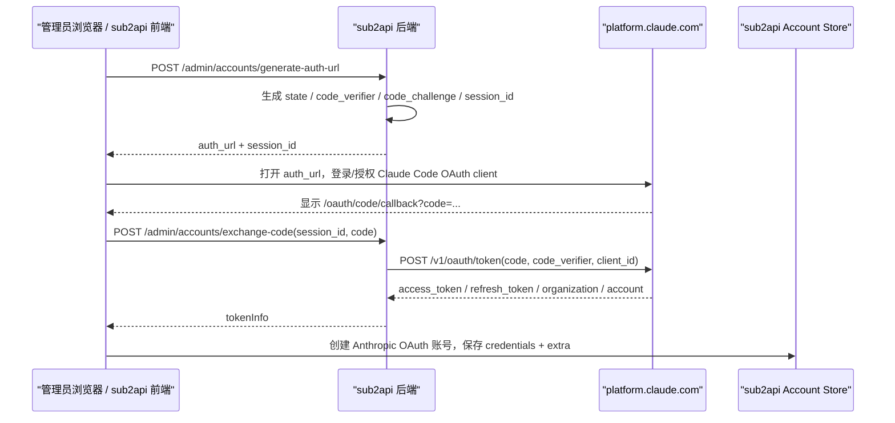

# Claude OAuth 添加账号 / 首次 Canary SOP

> 状态：上线前执行 SOP  
> 适用范围：Anthropic Claude OAuth / Setup Token 账号添加、首次真实 canary、服务器新账号首次授权  
> 更新时间：2026-05-20  
> 重要边界：本文只规范 **OAuth onboarding**。请求转发阶段仍以 `09-execution-handbook.md`、`10-claude-pre-launch-audit.md`、`11-code-modification-plan-v2.md` 为准。

---

## 0. 执行结论

第一轮 sub2api Claude OAuth 添加账号应使用 **官方手动 OAuth flow**，不要使用 cookie/sessionKey 自动授权，不要导入 refresh token，不要批量添加。

第一轮本机 canary 推荐配置：

```text
添加方式：手动 OAuth
账号代理：本机第一轮不选代理；如必须用代理，浏览器授权也必须走同一出口
TLS 指纹模拟：关闭
会话 ID 伪装：关闭
缓存 TTL 强制替换：关闭
自定义转发地址：关闭
enable_anthropic_cache_ttl_1h_injection：关闭
enable_cch_signing：关闭，除非已有 CCH 签名验证闭环
canary 请求数：1
canary prompt：短文本，例如 hello
```

本机已经登录过 Claude Code CLI **不是单独阻塞因素**。真正需要控制的是：

- 浏览器授权与后端 token exchange 的出口一致性；
- 不误用旧浏览器 cookie 选错账号/组织；
- 不使用 sessionKey/cookie 自动授权；
- 不导入外部 refresh token；
- 添加成功后不并发、不批量、不连续重试。

---

## 1. OAuth 添加账号链路图



关键文件：

| 环节 | 文件 / 函数 |
|---|---|
| 前端生成授权 URL | `/Users/muqihang/chelingxi_workspace/sub2api-zhumeng-main/.worktrees/claude-antiban-implementation/frontend/src/composables/useAccountOAuth.ts` `generateAuthUrl()` |
| 前端兑换授权码 | `/Users/muqihang/chelingxi_workspace/sub2api-zhumeng-main/.worktrees/claude-antiban-implementation/frontend/src/components/account/CreateAccountModal.vue` `handleAnthropicExchange()` |
| 后端路由 | `/Users/muqihang/chelingxi_workspace/sub2api-zhumeng-main/.worktrees/claude-antiban-implementation/backend/internal/handler/admin/account_handler.go` `GenerateAuthURL()` / `ExchangeCode()` |
| OAuth session / PKCE | `/Users/muqihang/chelingxi_workspace/sub2api-zhumeng-main/.worktrees/claude-antiban-implementation/backend/internal/service/oauth_service.go` `generateAuthURLWithScope()` |
| OAuth 常量 | `/Users/muqihang/chelingxi_workspace/sub2api-zhumeng-main/.worktrees/claude-antiban-implementation/backend/internal/pkg/oauth/oauth.go` |
| token exchange / refresh | `/Users/muqihang/chelingxi_workspace/sub2api-zhumeng-main/.worktrees/claude-antiban-implementation/backend/internal/repository/claude_oauth_service.go` |

---

## 2. 与 Claude Code OAuth 的对齐点

当前手动 OAuth 主链路使用以下 Claude Code OAuth 关键常量：

| 项目 | 当前值 |
|---|---|
| authorize endpoint | `https://platform.claude.com/oauth/authorize` |
| token endpoint | `https://platform.claude.com/v1/oauth/token` |
| client_id | `9d1c250a-e61b-44d9-88ed-5944d1962f5e` |
| redirect_uri | `https://platform.claude.com/oauth/code/callback` |
| browser scope | `org:create_api_key user:profile user:inference user:sessions:claude_code user:mcp_servers user:file_upload` |
| PKCE | `S256` |

因此，上游授权页/授权应用身份层面会接近 Claude Code OAuth。

但必须明确：**OAuth client_id 对齐不等于完整 CLI 行为对齐**。后续 `/v1/messages`、`/v1/messages/count_tokens` 是否像 Claude Code，仍依赖 strict passthrough / mimicry / header / body / beta / session / transport 策略。

---

## 3. 本机已登录 Claude Code CLI 后，再添加 sub2api OAuth 账号

### 3.1 不构成单独阻塞的事项

- 同一账号/同一 IP 对同一个 Claude Code OAuth client 再次授权，本身不必然异常。
- 不需要为了 sub2api OAuth 添加账号而退出本机 Claude Code CLI。
- 本机 CLI token 与 sub2api OAuth token 是不同存储，不会因为“本机已登录 CLI”自动污染 sub2api。

### 3.2 需要避免的事项

| 风险 | 说明 | 处理 |
|---|---|---|
| 旧浏览器 cookie 自动选错账号/组织 | 授权页可能直接进入已有 Claude 会话 | 用干净浏览器 profile / 隐身窗口，并人工确认账号 |
| 浏览器授权出口与后端 exchange 出口不同 | 本机浏览器直连、sub2api 后端走代理会形成 IP 分裂 | 第一轮本机不选代理；如必须选代理，浏览器也走同一代理 |
| 使用 cookie/sessionKey 自动授权 | 该链路访问 `claude.ai/api/organizations` 和内部 authorize API，不像正常 CLI 手动 OAuth | 禁用 |
| 导入 refresh token | 缺少完整授权上下文，不适合作为首轮 canary | 禁用 |
| 添加后连续重试/并发 | 异常时会放大风险 | 只做 1 个 hello canary |

---

## 4. 服务器新账号首次授权 SOP

服务器正式上线时，全新账号第一次直接登录 sub2api，应满足：

1. **一账号一稳定出口**
   - 优先高质量、长期稳定的住宅/ISP 出口。
   - 避免共享机房 IP、低价代理池、频繁换出口。

2. **浏览器授权出口与 token exchange 出口一致**
   - 最佳：在同一出口环境中打开浏览器授权，并由 sub2api 后端使用同一出口 exchange。
   - 可选：本地浏览器配置与账号相同的 SOCKS/HTTP 代理，再打开服务器生成的 auth URL。
   - 不推荐：本地家庭 IP 打开授权页，但服务器机房 IP 执行 token exchange。

3. **生成 auth URL 前就绑定代理**
   - 后端 OAuth session 会记录生成 URL 时的 proxy。
   - 不要生成 URL 后临时切换出口。

4. **只使用官方手动 OAuth**
   - 禁止 sessionKey/cookie 自动授权。
   - 禁止手动导入 refresh token。
   - 禁止同一日同一出口批量授权多个新账号。

5. **单实例或 sticky session**
   - 当前 OAuth session 为内存存储。
   - 多实例部署必须保证 `generate-auth-url` 与 `exchange-code` 命中同一实例，或后续改 Redis session。

---

## 5. 停止条件

任一条件触发即停止，不继续尝试：

- OAuth exchange 第一次失败，且错误原因不明确；
- 返回 `invalid_grant`、401、403；
- 授权页出现异常验证、KYC、unusual activity、third-party warning；
- 第一个 canary 请求出现账号级权限/风控异常；
- token refresh 失败；
- 同一账号需要连续重试才能成功；
- 浏览器授权出口和 token exchange 出口确认不一致。

---

## 6. 第一轮本机 canary 操作清单

执行前：

- [ ] 使用当前 anti-ban worktree 对应版本；
- [ ] `docs/anti-ban/07-pre-launch-checklist.md` Anthropic onboarding 项已核对；
- [ ] 不开启 MITM；
- [ ] 不设置 `ANTHROPIC_BASE_URL`；
- [ ] 不设置 `SSLKEYLOGFILE`；
- [ ] 不使用 cookie/sessionKey 自动授权；
- [ ] 不导入 refresh token；
- [ ] 不选择账号代理，或浏览器与后端确认同出口；
- [ ] 高级选项全部关闭；
- [ ] sub2api 单实例运行；
- [ ] 日志不要开启 raw body / debug gateway body。

执行中：

- [ ] 生成授权 URL；
- [ ] 用干净浏览器 profile / 隐身窗口打开；
- [ ] 人工确认登录的是目标账号；
- [ ] 粘贴授权 code，不粘贴 sessionKey；
- [ ] 创建账号；
- [ ] 只发 1 个短 hello canary；
- [ ] 观察 401/403/429/KYC/异常提示。

执行后：

- [ ] 记录时间、账号类型、出口、是否代理；
- [ ] 记录 canary 请求结果；
- [ ] 不扩大流量，先回看日志和响应；
- [ ] 如无异常，再进入下一 checkpoint。

---

## 7. 与高级选项的关系

第一轮 OAuth onboarding 与 first canary 不使用以下账号高级选项：

| 选项 | 第一轮 | 原因 |
|---|---|---|
| TLS 指纹模拟 | 关闭 | ALPN/HTTP2/JA3/JA4 尚未完成 Anthropic 专项验证 |
| 会话 ID 伪装 | 关闭 | 当前 strict/mimicry 主链路基本不依赖该开关，账号级固定 session 可能增加关联 |
| 缓存 TTL 强制替换 | 关闭 | 主要影响 usage/计费分类，不是 OAuth onboarding 防封关键 |
| 自定义转发地址 | 关闭 | relay 会改变上游观测面，并持有 Authorization / proxy query |

---

## 8. 文档维护

如果后续真实 OAuth onboarding 或 canary 观察到与本文不一致：

1. 先停止扩量；
2. 补充 safe deliverable，不提交 raw token / raw code / raw debug；
3. 更新本文；
4. 同步更新 `07-pre-launch-checklist.md` 与 `09-execution-handbook.md`。
