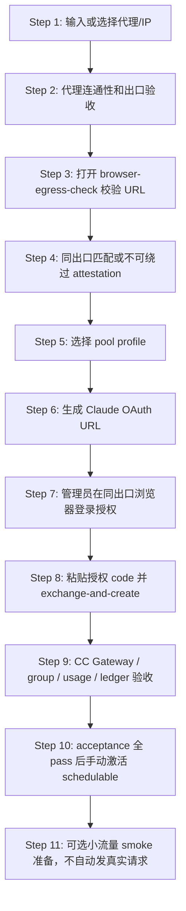

# 正式号池 Claude 订阅账号上号向导实施计划

> **For agentic workers:** REQUIRED SUB-SKILL: Use `superpowers:subagent-driven-development` or `superpowers:executing-plans` to implement this plan checkpoint-by-checkpoint. Steps use checkbox (`- [ ]`) syntax for tracking. At each checkpoint, run the listed tests and request a separate high-quality review before proceeding.

**Goal:** 在 Sub2API 前端/后端实现一个“Claude 订阅号池上号向导”，让管理员可以像当前手工上号一样安全、可重复地完成“代理/IP -> OAuth 授权 -> 账号创建 -> CC Gateway 正式号池配置 -> 验收”的全流程。

**Architecture:** 新增一个正式号池专用 onboarding 编排层，不复用普通账号创建表单里的危险高级选项。后端负责生成安全默认配置、校验代理和账号边界、写入 CC Gateway/formal-pool extra、执行验收；前端只展示向导化流程和明确结果，不让操作者手动拼接关键字段。现有 `CreateAccountModal` 保持通用能力，上号向导作为独立入口，避免和普通 Anthropic/APIKey/SetupToken/TLS 等高级选项混用。

**Tech Stack:** Go/Gin/Ent service + existing admin account/proxy/OAuth APIs, Vue 3 + TypeScript + existing admin API client, current CC Gateway adapter/policy/session budget/usage ledger.

---

## 1. 背景与目标边界

当前我们手工上号已经跑通过真实小流量链路：

```text
用户 Claude Code 请求
-> Sub2API
-> CC Gateway
-> 账号绑定 egress bucket / SOCKS5 出口
-> Anthropic
```

手工成功账号的关键状态包括：

```text
platform=anthropic
type=oauth
status=active
schedulable=false  # acceptance 前必须不可调度
concurrency=10
proxy_id=<一账号一代理>
cc_gateway_enabled=true
cc_gateway_canary_only=false
cc_gateway_policy_version=2.1.150 或动态兼容版本
cc_gateway_routes=native_messages
cc_gateway_egress_bucket_enabled=true
cc_gateway_egress_bucket=<账号专属 bucket>
cc_gateway_account_ref=<server generated opaque/HMAC ref>
pool_profile=normal 或 aggressive
onboarding_state=pending_acceptance
```

本计划的目标是把上述状态产品化，不再依赖人工数据库修改、手动拼配置、临时脚本或记忆操作。

### 1.1 必须做到

1. 一账号一 IP / 一账号一 egress bucket 绑定。
2. 浏览器 OAuth 授权出口与服务器 token exchange / 运行请求出口一致，并且必须有不可绕过的证据门禁。
3. 创建出来的账号与手工成功账号效果一致：acceptance 通过后能被正式号池调度，走 CC Gateway，走指定代理出口，ledger 正常产出。
4. 默认使用正式 Claude Code OAuth，不默认 Setup Token，不默认 cookie/sessionKey。
5. 隐藏或禁用会与 CC Gateway/formal pool 冲突的普通高级选项。
6. 默认不限制 Claude Code 能力：不削 1m context、Opus/Sonnet、thinking、tools、stream、`max_tokens=32000`。
7. 默认 observe-only session/account budget，只 hard block 明显 P0 安全问题。
8. 所有结果可审计、可回滚、可脱敏展示。

### 1.2 明确不做

本阶段不做：

- 不做 raw telemetry 真实上传；
- 不做 control-plane 全量真实上传；
- 不做浏览器指纹环境自动化登录；
- 不保存 Claude 账号密码；
- 不导入 cookie/sessionKey 作为默认路径；
- 不把代理密码、OAuth token、refresh token、raw body、raw prompt、raw CCH 展示到前端；
- 不把账号加入正式号池前自动发真实 `/v1/messages`；真实 smoke 必须由管理员明确点击，并遵守小流量策略。

---

## 2. 推荐方案

### 2.1 方案选择

推荐采用 **独立“Claude 订阅号池上号向导”**，而不是在现有 `CreateAccountModal.vue` 里继续叠加字段。

原因：

- 现有创建账号弹窗承载 OpenAI/Gemini/Antigravity/Anthropic/APIKey/OAuth/SetupToken/TLS/缓存 TTL/会话伪装等大量通用能力，容易误点危险选项。
- 正式号池上号有严格顺序：代理验证 -> 生成 OAuth URL -> 同出口授权 -> exchange -> 创建账号 -> CC Gateway 验收 -> ledger/usage 验收。
- 独立向导可以内置安全默认值，减少人为错误，后续批量上号也更容易扩展。

### 2.2 向导步骤



---

## 3. 安全默认值

### 3.1 账号默认值

向导创建账号时，后端必须统一写入：

```json
{
  "platform": "anthropic",
  "type": "oauth",
  "status": "active",
  "schedulable": false,
  "concurrency": 10,
  "load_factor": null,
  "priority": 0,
  "proxy_id": "selected_proxy_id",
  "group_ids": ["selected_claude_code_only_group_id"],
  "extra": {
    "cc_gateway_enabled": "true",
    "cc_gateway_canary_only": "false",
    "cc_gateway_policy_version": "2.1.150",
    "cc_gateway_routes": "native_messages",
    "cc_gateway_egress_bucket_enabled": "true",
    "cc_gateway_egress_bucket": "generated_or_selected_bucket",
    "cc_gateway_account_ref": "server_generated_opaque_or_hmac_ref",
    "pool_profile": "normal",
    "oauth_refresh_fail_closed": "true",
    "onboarding_state": "pending_acceptance"
  }
}
```

说明：

- `cc_gateway_routes` 第一阶段默认只开 `native_messages`，避免把未产品化的 route 意外放进正式号池。
- `native_count_tokens`、`chat_completions`、`responses` 后续必须走单独审查/灰度，不在向导默认启用。
- `cc_gateway_policy_version` 第一版可以默认 `2.1.150`，但 UI 必须标注“由动态 Persona/Model Resolver 后续接管”；实现时预留读取当前 runtime supported policy 的接口。
- `pool_profile` 支持 `normal` 和 `aggressive`，默认 `normal`。
- `aggressive` 只改变调度权重/追赶目标，不绕过 cooldown/quarantine/P0 hard block。
- 并发默认 10；高于 10 必须二次确认，高于全局 `formal_pool_onboarding.max_concurrency` 必须拒绝；这只保护账号并发，不限制 Claude Code body/tools/thinking/1m 能力。
- `cc_gateway_account_ref` 必须由后端生成，不允许前端传入，不允许 raw numeric id fallback 成为正式号池身份。若当前 CC Gateway runtime 仍使用 numeric id，acceptance 必须显式记录兼容状态，并在正式调度前完成 ref 映射。
- 账号创建后保持 `schedulable=false` 和 `onboarding_state=pending_acceptance`；只有 acceptance 全部通过，后端才原子切换为 `schedulable=true`、`onboarding_state=ready_for_small_flow`。

### 3.2 禁止默认打开的选项

向导模式中不得暴露或默认开启：

| 选项 | 策略 | 原因 |
|---|---|---|
| TLS 指纹模拟 | 隐藏/禁用 | CC Gateway 已接管最终 persona；该选项属于原生 Sub2API 路径，混用会扩大观测面 |
| Metadata 透传 | 禁用 | 可能把本地/用户侧不该上传的 metadata 透给上游 |
| 原生 CCH 签名 | 禁用 | messages 签名归 CC Gateway 控制，不能双签/错签 |
| Anthropic cache TTL 注入 | 禁用 | 未经过正式控制面/usage A/B 固化 |
| session id masking | 禁用 | 正式 CLI-through 应保留真实/可信 session shape，不做账号级伪装 |
| cookie/sessionKey 导入 | 非默认，高风险入口另审 | 容易形成非正常登录路径和账号/出口不一致 |
| Setup Token | 非默认，高风险入口另审 | 更像脚本/CI/服务器自动化，不作为正式订阅号池默认路径 |
| 自定义 base URL | 禁用 | 账号上号路径必须固定走 CC Gateway/runtime，不让操作者绕路 |

### 3.3 不限制 Claude Code 能力

向导不得写入会削弱能力的 hard limit：

- 不写低 `max_tokens`；
- 不限制 Opus/Sonnet；
- 不限制 1m context；
- 不限制 thinking；
- 不限制 tools 数量；
- 不限制 stream；
- 不把 canary `max_messages=1` 带入正式账号；
- 不写 `max_sessions`、`base_rpm`、`window_cost_limit` 等旧硬限，除非后续 session budget 已审查为 observe/shadow/enforcement。

---

## 4. 后端设计

### 4.1 新增服务：FormalPoolOnboardingService

建议新增：

```text
/Users/muqihang/chelingxi_workspace/sub2api-zhumeng-main/.worktrees/claude-antiban-implementation/backend/internal/service/formal_pool_onboarding_service.go
```

职责：

1. 接收向导输入；
2. 创建或复用代理；
3. 运行代理连通性和质量检查；
4. 生成 egress bucket 标识和 account/proxy safe refs；
5. 生成 OAuth URL；
6. 处理 auth code exchange；
7. 创建账号并写入正式号池 extra；
8. 绑定 Claude Code only group；
9. 运行只读验收；
10. 输出脱敏 onboarding summary。

建议 DTO：

```go
type FormalPoolOnboardingStartRequest struct {
    ProxyMode string `json:"proxy_mode"` // existing|create
    ProxyID *int64 `json:"proxy_id,omitempty"`
    Proxy *FormalPoolProxyInput `json:"proxy,omitempty"`
    PoolProfile string `json:"pool_profile"` // normal|aggressive
    GroupID int64 `json:"group_id"`
    AccountName string `json:"account_name"`
    Notes string `json:"notes,omitempty"`
    Concurrency int `json:"concurrency"`
}

type FormalPoolProxyInput struct {
    Name string `json:"name"`
    Protocol string `json:"protocol"` // http|https|socks5|socks5h
    Host string `json:"host"`
    Port int `json:"port"`
    Username string `json:"username,omitempty"`
    Password string `json:"password,omitempty"`
}

type FormalPoolOnboardingSession struct {
    ID string `json:"id"`
    Status string `json:"status"`
    ProxyID int64 `json:"proxy_id"`
    EgressBucket string `json:"egress_bucket"`
    PoolProfile string `json:"pool_profile"`
    GroupID int64 `json:"group_id"`
    AuthURL string `json:"auth_url,omitempty"`
    OAuthSessionID string `json:"oauth_session_id,omitempty"`
    SafeSummary map[string]any `json:"safe_summary"`
}
```

### 4.2 同出口证据硬门禁

“请在同出口浏览器登录”不能只靠提示。向导必须提供一个不可绕过的同出口确认步骤：

1. 服务器先用所选 proxy 执行 `TestProxy/CheckProxyQuality`，得到代理出口 IP。
2. 前端生成一个 `browser_egress_check_url`，管理员必须在准备打开 Claude OAuth 的同一个指纹浏览器/代理环境里访问。
3. 后端记录该访问的 remote IP，并与代理出口 IP 做精确匹配或按配置允许的等价出口集合匹配。
4. 不匹配时：禁止生成 OAuth URL，禁止 exchange-code，禁止创建账号。
5. 匹配结果只保存脱敏摘要：`browser_egress_matched=true/false`、`exit_ip_ref`、`checked_at`，不保存代理密码。

`browser_egress_check_url` 安全要求：

- URL 使用短期签名 nonce，不依赖目标浏览器已经登录后台；
- nonce 绑定 onboarding session、proxy_ref、operator admin id、过期时间；
- nonce 一次性使用，TTL 默认 5 分钟；
- 后端只记录 remote IP 的 safe ref、匹配结果、时间，不记录代理密码或完整敏感上下文；
- nonce 过期、重复使用、session 不匹配都 fail closed；
- 未通过 browser egress check 时，后端禁止 `generate-auth-url`、`exchange-code-and-create`、`acceptance`、`activate`。

如果技术上无法自动读取真实浏览器出口，则必须降级为**不可绕过人工 attestation**：管理员勾选“我已确认浏览器出口等于代理出口”，并填写脱敏校验码；系统记录 attestation id。没有自动匹配或 attestation，状态不得超过 `blocked_browser_egress_unverified`。

### 4.3 新增后端路由

建议新增 handler：

```text
/Users/muqihang/chelingxi_workspace/sub2api-zhumeng-main/.worktrees/claude-antiban-implementation/backend/internal/handler/admin/formal_pool_onboarding_handler.go
```

建议路由：

```text
POST /api/v1/admin/claude-onboarding/sessions
GET  /api/v1/admin/claude-onboarding/sessions/:id
POST /api/v1/admin/claude-onboarding/sessions/:id/test-proxy
GET  /api/v1/admin/claude-onboarding/sessions/:id/browser-egress-check
POST /api/v1/admin/claude-onboarding/sessions/:id/browser-egress-attestation
POST /api/v1/admin/claude-onboarding/sessions/:id/generate-auth-url
POST /api/v1/admin/claude-onboarding/sessions/:id/exchange-code-and-create
POST /api/v1/admin/claude-onboarding/sessions/:id/acceptance
POST /api/v1/admin/claude-onboarding/sessions/:id/activate
POST /api/v1/admin/claude-onboarding/sessions/:id/abort
```

设计原因：

- 不直接让前端拼 `/generate-auth-url` + `/exchange-code` + `/accounts`，避免漏字段。
- 每一步都有 session id，可恢复、可审计、可显示进度。
- session 中不存 raw token；`exchange-code-and-create` 必须在同一后端请求内完成 token exchange 和账号创建，前端永不接收 tokenInfo 明文。

### 4.4 固定流程：exchange-code 即创建账号

为了减少 token 在前端流转，后端必须采用：

```text
exchange-code-and-create(code) -> 后端 exchange token -> 后端立即创建不可调度账号 -> 返回脱敏账号摘要
```

前端不接收 access token / refresh token / org uuid / account uuid 明文。

前端 API 永远不得返回 access token、refresh token、account UUID、org UUID、email 明文。返回值只能是脱敏摘要：

```json
{
  "email_present": true,
  "account_uuid_present": true,
  "organization_uuid_present": true,
  "scope_contains_user_inference": true,
  "expires_in_bucket": "gt_1h"
}
```

内部 token 生命周期规则：

- tokenInfo 只能在 `exchange-code-and-create` 请求内存中使用，优先不跨请求暂存；
- 如果必须暂存，必须 single-use、短 TTL、进程内或加密存储、不可日志化、不可导出；
- 任一失败路径必须清除暂存 tokenInfo；
- onboarding session 只能保存 token presence/scope bucket，不保存 token 值；
- 所有日志和 safe summary 禁止 raw code/token/email/account UUID/org UUID。

正式 OAuth gate：

- 必须由 `generate-auth-url` 创建的正式 OAuth session 进入；
- 不接受 setup-token URL 生成的 session；
- 不接受 cookie/sessionKey 自动授权；
- scope 不仅要包含 `user:inference`，还要校验这是完整 Claude Code OAuth flow 标记，而不是 inference-only/setup-token-like token。

### 4.5 Egress bucket 生成

第一阶段可以只在 Sub2API 账号 extra 中写入 `cc_gateway_egress_bucket`，并要求 CC Gateway runtime 已预先存在同名 bucket；后续再做 CC Gateway bucket API 动态写入。

建议 bucket 命名：

```text
claude-<proxy-ip-safe-fragment>-<account-id-or-session-short-ref>
```

但 safe deliverable / UI 只展示 bucket 名，不展示代理密码。

代理一致性规则：

- `TestProxy`、`CheckProxyQuality`、OAuth exchange、CC Gateway runtime bucket 必须使用同一套规范化 proxy resolver；
- `socks5://` 必须规范化为远程 DNS 语义，或明确升级为 `socks5h://`；
- 任一阶段 proxy 解析失败都必须 fail closed，禁止回退直连；
- acceptance 必须比较 proxy test 出口和 CC Gateway bucket 出口配置引用。

验收规则：

1. proxy_id 必须存在且 active；
2. proxy test 必须 pass；
3. socks5 输入应规范化为 socks5h 行为，避免 DNS 泄漏；
4. CC Gateway runtime 必须能解析该 bucket；
5. bucket allowed account 必须包含新账号 ref/id；
6. bucket proxy 出口必须和测试结果一致。

### 4.6 Group 绑定

向导必须要求选择 Claude Code only group，或提供“创建/选择默认正式号池分组”的入口。

验收规则：

- group status active；
- group platform 为 Anthropic/Claude 相关正式池；
- group `claude_code_only=true`；
- group fallback 策略安全：非 Claude Code 客户端必须拒绝或降级到非共享池分组，不能进入本账号池；
- group 不混入普通 Anthropic APIKey / 非 Claude Code 路径 / Antigravity / OpenAI；
- group model routing 不限制 Opus/Sonnet、1m context、thinking、tools、stream、`max_tokens=32000`；
- API Key 进入该 group 后只允许 Claude Code 客户端请求，非 Claude Code 请求走降级分组或拒绝；
- 混合渠道检查仍生效，只有明确确认才可跳过；
- acceptance 前不得把用户 API Key 指向该账号/分组作为生产入口。

### 4.7 Onboarding session 存储、幂等与回滚

向导 session 必须有明确状态机：

```text
draft
-> proxy_verified
-> browser_egress_verified
-> oauth_url_generated
-> oauth_exchanged_account_created
-> pending_acceptance
-> ready_for_small_flow
或 failed/aborted
```

存储要求：

- session TTL，默认 30-60 分钟；
- 支持幂等 request id，避免重复创建代理/账号；
- session safe audit 只存 refs/buckets/status，不存 secret；
- abort 会清理未使用 OAuth session、临时 tokenInfo、临时 acceptance artifact；
- 如果 proxy 是本向导新建且尚未绑定账号，abort 可标记 inactive，但不得删除；
- 如果账号已创建但 acceptance 失败，账号保持 `schedulable=false`，`onboarding_state=failed_acceptance`，不得进入调度；
- group 绑定失败、bucket missing、scope 缺失、proxy mismatch 均进入不可调度失败态。

### 4.8 Acceptance 验收

创建账号后，后端 acceptance 只做安全检查，默认不发真实 `/v1/messages`。

必查：

- account active；
- acceptance 前 schedulable 必须为 false；
- proxy active；
- proxy test pass；
- OAuth credentials 包含 refresh token 且 scope 含 `user:inference`；
- `oauth_refresh_fail_closed=true`；
- `cc_gateway_enabled=true`；
- `cc_gateway_canary_only=false`；
- `cc_gateway_routes=native_messages`；
- `cc_gateway_egress_bucket_enabled=true`；
- `cc_gateway_egress_bucket` 非空；
- `cc_gateway_account_ref` 非空且 safe；
- CC Gateway runtime bucket 存在、enabled、proxy identity 匹配、allowed account/ref 包含该账号；
- `pool_profile in normal/aggressive`；
- group 绑定正确且 group 不限制 Claude Code 能力；
- 后端 effective extra allowlist 无危险项；
- session/account budget observe sink 已启用；
- localhost/mock 请求可产生脱敏 ledger 记录，且不访问真实 upstream；
- usage passive source 本地可读；不得为了验收主动访问真实 usage/control-plane；
- sensitive scan 对 onboarding safe summary 无 finding。

输出：

```json
{
  "status": "pending_activation",
  "account_id": 123,
  "account_ref": "hmac-or-opaque-ref",
  "proxy_ref": "hmac-or-opaque-ref",
  "egress_bucket": "bucket-name",
  "pool_profile": "normal",
  "checks": [
    {"name":"proxy_active","status":"pass"},
    {"name":"user_inference_scope","status":"pass"},
    {"name":"cc_gateway_extra","status":"pass"},
    {"name":"group_claude_code_only","status":"pass"}
  ],
  "no_real_messages_request_performed": true,
  "activation_required": true
}
```

---

## 5. 前端设计

### 5.1 新页面

建议新增：

```text
frontend/src/views/admin/ClaudeOnboardingWizardView.vue
frontend/src/components/account/ClaudeFormalPoolOnboardingWizard.vue
frontend/src/api/admin/claudeOnboarding.ts
```

路由：

```text
/admin/claude-onboarding
```

入口：

- `/admin/accounts` 顶部新增“Claude 正式号池上号向导”；
- 保留现有“创建账号”，但向导是推荐入口；
- 普通创建弹窗中 Anthropic OAuth 可提示“正式号池请使用上号向导”。

### 5.2 页面步骤

1. **代理/IP**
   - 选择已有代理或创建新代理；
   - 支持 `socks5/socks5h/http/https`；
   - 输入代理密码时只本次显示，不回显旧密码；
   - 点击“测试代理”，展示出口 IP、地区、延迟、质量分，不展示密码。

2. **同出口校验**
   - 生成短期 `browser_egress_check_url`；
   - 管理员必须在即将登录 Claude 的同一个指纹浏览器/代理环境打开该 URL；
   - UI 展示 `matched / mismatched / expired / attestation_required`；
   - 未 matched 或未完成不可绕过 attestation 时，“生成 OAuth URL”按钮禁用；
   - attestation 必须显示风险说明，并记录 operator、session、proxy_ref、时间。

3. **账号策略**
   - pool profile：normal/aggressive；
   - 并发：默认 10；
   - 分组：默认 Claude Code smoke/formal group；
   - 说明 aggressive 是更高调度权重，不降低安全线。

4. **OAuth 授权**
   - 点击生成 OAuth URL；
   - 页面提示“请在与该代理一致的浏览器出口中打开”；
   - 用户粘贴 code；
   - 不提供 cookie/sessionKey 默认入口。

5. **创建账号**
   - 显示脱敏 OAuth 摘要；
   - 点击创建；
   - 账号自动写入正式号池 extra。

6. **验收与激活**
   - 展示 checks；
   - acceptance 前明确展示“账号不可调度”；
   - 全部 pass 后显示“可手动激活为小流量可用”；
   - 管理员点击“激活”后才调用 `/activate`，账号变为 `schedulable=true`；
   - 不自动发真实请求。

### 5.3 前端禁止项

向导 UI 不出现以下开关：

- TLS 模板；
- Metadata 透传；
- CCH 签名模式；
- Anthropic cache TTL 注入；
- Session ID masking；
- 自定义 base URL；
- 原生 Setup Token 默认入口；
- Cookie/sessionKey 默认入口。

---

## 6. 实施任务分解

### Checkpoint 1：后端只读审计与 DTO/路由骨架

**Files:**

- Create: `backend/internal/service/formal_pool_onboarding_service.go`
- Create: `backend/internal/service/formal_pool_onboarding_store.go`
- Create: `backend/internal/service/formal_pool_onboarding_service_test.go`
- Create: `backend/internal/handler/admin/formal_pool_onboarding_handler.go`
- Modify: `backend/internal/server/routes/admin.go`
- Modify as needed: `backend/internal/handler/handlers.go` or handler wiring files

**Steps:**

- [ ] 写测试：创建 onboarding session 时，缺 proxy/group/account_name 会返回 400。
- [ ] 写测试：`pool_profile` 只允许 `normal/aggressive`，默认 `normal`。
- [ ] 写测试：session safe summary 不包含 proxy password/token/email/account UUID。
- [ ] 写测试：session TTL、幂等 request id、abort 状态不会泄露 secret。
- [ ] 实现 DTO、store、service skeleton、handler skeleton。
- [ ] 注册 `/api/v1/admin/claude-onboarding/*` 路由。
- [ ] 跑：

```bash
cd /Users/muqihang/chelingxi_workspace/sub2api-zhumeng-main/.worktrees/claude-antiban-implementation/backend
go test ./internal/service ./internal/handler ./internal/server/routes -run 'FormalPoolOnboarding|ClaudeOnboarding|AdminRoutes' -count=1
```

**Review gate:** 路由和 DTO 只读审查，确认没有暴露 secret 字段。

### Checkpoint 2：代理创建/复用与出口验收

**Files:**

- Modify: `backend/internal/service/formal_pool_onboarding_service.go`
- Modify: `backend/internal/service/formal_pool_onboarding_service_test.go`
- Maybe reuse: `backend/internal/service/admin_service.go` proxy methods
- Maybe reuse: `backend/internal/pkg/proxyurl/parse.go`

**Steps:**

- [ ] 写测试：创建新 socks5 代理时，最终使用 socks5h 语义或至少验收远程 DNS 行为。
- [ ] 写测试：已有 proxy inactive 时 fail closed。
- [ ] 写测试：proxy test fail 时 session 不能进入 OAuth step。
- [ ] 写测试：safe summary 中 proxy credential 被 omitted/ref 化。
- [ ] 实现 create/reuse proxy。
- [ ] 调用现有 `TestProxy` / `CheckProxyQuality`。
- [ ] 保存脱敏 proxy_ref、exit_ip bucket、latency bucket。

**Review gate:** 确认不会因代理错误回退直连。

### Checkpoint 3：OAuth URL 与 exchange-code 后端化

**Files:**

- Modify: `backend/internal/service/formal_pool_onboarding_service.go`
- Modify: `backend/internal/service/formal_pool_onboarding_service_test.go`
- Reuse: `backend/internal/service/oauth_service.go`
- Reuse: `backend/internal/handler/admin/account_handler.go` OAuth patterns

**Steps:**

- [ ] 写测试：生成 OAuth URL 必须带 session proxy_id。
- [ ] 写测试：browser egress 未验证时禁止生成 OAuth URL。
- [ ] 写测试：exchange-code 使用 session 中的 proxy_id，前端传不同 proxy_id 时拒绝。
- [ ] 写测试：exchange-code-and-create 不把 tokenInfo 明文返回前端。
- [ ] 写测试：缺 `user:inference` scope fail closed。
- [ ] 写测试：setup-token-like / inference-only flow 被正式向导拒绝。
- [ ] 实现 generate-auth-url wrapper。
- [ ] 实现 `exchange-code-and-create`：tokenInfo 仅后端内存使用，立即创建不可调度账号。
- [ ] 日志只写 safe refs，不写 code/token/email/account UUID。

**Review gate:** OAuth 出口一致性和 token 不出后端审查。

### Checkpoint 4：账号创建与正式号池 extra 固化

**Files:**

- Modify: `backend/internal/service/formal_pool_onboarding_service.go`
- Modify: `backend/internal/service/formal_pool_onboarding_service_test.go`
- Reuse: `backend/internal/service/admin_service.go` `CreateAccount`
- Reuse: `backend/internal/service/cc_gateway_adapter.go`

**Steps:**

- [ ] 写测试：创建账号后 extra 精确包含正式号池默认项。
- [ ] 写测试：创建账号后 acceptance 前 `schedulable=false`。
- [ ] 写测试：强制生成 `cc_gateway_account_ref`，不允许 raw numeric id fallback 成为正式身份。
- [ ] 写测试：默认不写 TLS/session masking/cache TTL/native CCH/custom base URL 等危险项。
- [ ] 写测试：默认 routes 只有 `native_messages`，并把 count_tokens 兼容风险记录为 warning。
- [ ] 写测试：concurrency 默认 10；大于 10 需要显式确认；超过全局最大值拒绝。
- [ ] 写测试：`aggressive` 只写 `pool_profile=aggressive`，不绕过 P0/cooldown/quarantine。
- [ ] 实现 account create。
- [ ] 绑定 selected Claude Code only group。
- [ ] 账号创建后生成/写入 safe account ref，如当前运行时需要 raw numeric id，则文档标明由 CC Gateway runtime identity mapping 约束，不把 raw id 放入 safe deliverable。

**Review gate:** 与手工成功账号效果一致性审查。

### Checkpoint 5：Acceptance 验收与 usage/ledger 接入

**Files:**

- Modify: `backend/internal/service/formal_pool_onboarding_service.go`
- Modify: `backend/internal/service/formal_pool_onboarding_service_test.go`
- Reuse: `backend/internal/service/account_usage_service.go`
- Reuse: `backend/internal/service/session_budget_observe.go`
- Reuse: `backend/internal/service/cc_gateway_adapter.go`

**Steps:**

- [ ] 写测试：account active 但 acceptance 前 schedulable=false；proxy/group/cc_gateway extra 全 pass。
- [ ] 写测试：group/model routing 不限制 Opus/Sonnet、1m context、thinking、tools、stream、max_tokens=32000。
- [ ] 写测试：usage passive missing 时 warning，不误判为 P0。
- [ ] 写测试：CC Gateway bucket missing 时 readiness fail closed。
- [ ] 写测试：如果 CC Gateway 没有 readiness API，必须通过 runtime config snapshot 或不可绕过 operator attestation 验证 bucket/account_ref。
- [ ] 写测试：localhost/mock ledger probe 可写入脱敏 ledger，且不访问真实 upstream。
- [ ] 写测试：验收不发真实 `/v1/messages`。
- [ ] 写测试：activation 只有 acceptance 全 pass 后才把账号切为 `schedulable=true`。
- [ ] 实现 acceptance endpoint。
- [ ] 输出脱敏 summary。

**Review gate:** 验收不产生真实请求；readiness fail closed 质量审查。

### Checkpoint 6：前端 API 与向导页面

**Files:**

- Create: `frontend/src/api/admin/claudeOnboarding.ts`
- Create: `frontend/src/views/admin/ClaudeOnboardingWizardView.vue`
- Create: `frontend/src/components/account/ClaudeFormalPoolOnboardingWizard.vue`
- Modify: `frontend/src/router/index.ts`
- Modify: `frontend/src/components/account/CreateAccountModal.vue` only to add pointer/banner if needed
- Modify: i18n files if present for admin account labels

**Steps:**

- [ ] 写前端单元测试：向导默认隐藏危险选项。
- [ ] 写前端单元测试：proxy password 不在验收摘要中显示。
- [ ] 写前端单元测试：browser-egress-check 未 matched 时无法生成 OAuth URL。
- [ ] 写前端单元测试：nonce expired/mismatch 时按钮保持禁用并显示 fail-closed 状态。
- [ ] 写前端单元测试：attestation_required 时必须完成不可绕过确认才允许继续。
- [ ] 写前端单元测试：acceptance pass 前显示不可调度，pass 后仍需手动 activate。
- [ ] 写前端单元测试：activate 成功后才显示 ready_for_small_flow。
- [ ] 写前端单元测试：normal/aggressive 文案说明不会降低安全线。
- [ ] 写 API client。
- [ ] 写 wizard 页面。
- [ ] 在 account 页面加入口。
- [ ] 跑：

```bash
cd /Users/muqihang/chelingxi_workspace/sub2api-zhumeng-main/.worktrees/claude-antiban-implementation/frontend
pnpm test
pnpm build
# 如项目测试框架支持串行参数，再使用对应框架参数；不要假设 --runInBand 一定有效。
```

**Review gate:** UI 不误导、不泄密、不暴露危险开关。

### Checkpoint 7：端到端 localhost-only 验证

**Files:**

- Create/Modify tests as needed under `backend/internal/handler/admin/*formal_pool_onboarding*_test.go`
- Optional: `tools/claude_onboarding_acceptance_probe.py` if project already uses Python harness style

**Steps:**

- [ ] localhost-only mock OAuth client 测试：不访问真实 Anthropic/Claude 域名。
- [ ] mock proxy test pass。
- [ ] mock browser egress mismatch 必须阻断 OAuth URL / exchange / create / activate。
- [ ] mock OAuth client 返回含 `user:inference` 的 tokenInfo，但 API 响应只返回脱敏摘要。
- [ ] create account。
- [ ] acceptance pass。
- [ ] 生成 safe summary。
- [ ] sensitive scan pass。
- [ ] 不发真实 `/v1/messages`。

**Commands:**

```bash
cd /Users/muqihang/chelingxi_workspace/sub2api-zhumeng-main/.worktrees/claude-antiban-implementation/backend
go test ./internal/service ./internal/handler ./internal/server/routes -run 'FormalPoolOnboarding|ClaudeOnboarding|OAuth|Proxy|CCGateway|SessionBudget|Usage' -count=1 -timeout=180s

cd /Users/muqihang/chelingxi_workspace/sub2api-zhumeng-main/.worktrees/claude-antiban-implementation
python3 tools/safe_deliverable_sensitive_scan.py --max-findings 100
```

**Review gate:** 全链路只走 mock/localhost，不触发真实请求。

### Checkpoint 8：文档、运营手册与最终审查

**Files:**

- Modify: `docs/anti-ban/13-claude-oauth-onboarding-sop.md`
- Modify: `docs/anti-ban/staging/2026-05-25-harness-engineering-sor.md`
- Modify: `docs/anti-ban/README.md`
- Create: `docs/anti-ban/42-claude-onboarding-wizard-operator-runbook.md`

**Steps:**

- [ ] 写管理员使用 SOP。
- [ ] 写故障处理：proxy fail、OAuth invalid_grant、scope 缺失、CC Gateway bucket missing、ledger missing、429/403/KYC。
- [ ] 写“什么时候可以小流量运营”的验收标准。
- [ ] 写“哪些不能点/不能改”的前端说明。
- [ ] 跑全量 targeted tests。
- [ ] 最终 review agent 审查 P0/P1/P2/Unknown。

---

## 7. 测试计划

### 7.1 后端必须覆盖

- Proxy 创建/复用/失败；
- socks5 -> socks5h 防 DNS 泄漏语义；
- OAuth URL 绑定 proxy；
- exchange-code 出口一致性；
- tokenInfo 不返回前端；
- `user:inference` scope gate；
- 正式号池 extra 精确写入；
- 禁止危险 extra；
- group Claude Code only gate；
- CC Gateway route/bucket/policy readiness；
- acceptance 不发真实 messages；
- safe summary sensitive scan。

### 7.2 前端必须覆盖

- 向导流程状态机；
- browser-egress-check / attestation 前端门禁；
- acceptance pass 后手动 activate 状态；
- 默认 normal；
- aggressive 文案；
- concurrency 默认 10；
- 代理密码不回显；
- 不显示危险开关；
- OAuth URL copy/open；
- code 粘贴；
- 验收结果展示；
- 错误状态 fail closed。

### 7.3 真实前置验收

实现完成后，真实上号前必须先跑：

1. localhost-only mock onboarding；
2. 使用测试代理的 proxy quality check；
3. OAuth URL 只生成，不登录；
4. sensitive scan；
5. 手工确认 CC Gateway runtime 有目标 egress bucket；
6. 单账号真实 OAuth 登录需单独批准；
7. 小流量真实使用需在账号 acceptance pass 后单独进入运营。

---

## 8. 风险与处理

| 风险 | 处理 |
|---|---|
| 管理员浏览器出口与服务器代理出口不一致 | browser-egress-check 或不可绕过 attestation 是硬门禁；不满足则禁止 OAuth URL / exchange / create |
| 代理可连但 Anthropic 不稳定 | proxy quality check 拆分 base_connectivity / anthropic target / challenge / latency |
| CC Gateway runtime 没有对应 bucket | acceptance fail closed，账号保持 schedulable=false，直到 bucket 就绪 |
| 前端误点高级开关 | 独立向导不展示危险开关 |
| Setup Token 路径被误用 | 默认不提供；需要后续专门策略 |
| token 泄漏 | exchange-code 后端化；前端只见脱敏摘要 |
| route 放太宽 | 默认只 `native_messages`；其他 route 后续灰度 |
| aggressive 被误解为绕安全线 | UI 和 backend 都只写 pool_profile，不改变 P0/cooldown/quarantine |

---

## 9. 上线顺序

1. 后端 skeleton + tests；
2. 代理与 OAuth 出口一致性；
3. 账号创建 extra 固化；
4. acceptance；
5. 前端 wizard；
6. localhost-only E2E，包括 mock ledger probe；
7. 文档和 runbook；
8. 单账号真实 OAuth 上号；
9. 小流量真实运营。

不得跳过 localhost-only E2E 和 review gate。

---

## 10. 完成定义

完成后，管理员应能在前端完成：

1. 输入或选择一个代理；
2. 验证代理可用；
3. 在同一浏览器/代理环境完成 browser-egress-check 或不可绕过 attestation；
4. 选择 normal/aggressive；
5. 生成 OAuth URL；
6. 在同出口浏览器登录 Claude；
7. 粘贴 code；
8. 后端创建账号但保持不可调度；
9. 自动写入 CC Gateway/formal-pool 安全配置；
10. 自动验收；
11. 验收全 pass 后手动激活为可调度；
12. 账号状态与当前手工上号效果一致，可进入小流量运营。

成功标准：

- 创建出的账号不用人工改数据库；
- 不用人工拼 CC Gateway extra；
- 不暴露 token/proxy password/raw identity；
- 不默认启用冲突高级选项；
- 不限制 Claude Code 能力；
- normal/aggressive 调度策略可用；
- ledger/usage/readiness 有脱敏证据；
- acceptance 前账号不可被用户流量命中；
- 审查 P0/P1=0。


## 11. 当前实现状态

- 后端已新增正式号池 onboarding service/store/handler/route 骨架和本地 mock 流程。
- 已提供独立前端入口 `/admin/claude-onboarding`，不复用普通 `CreateAccountModal` 的危险高级选项。
- exchange-code-and-create 由后端编排；前端只显示脱敏 OAuth summary。
- acceptance/activation 为本地安全检查与手动激活流程；不会发真实 Anthropic/Claude messages。
- 真实 OAuth 登录和真实 smoke 仍需单独批准。

Runbook: `docs/anti-ban/42-claude-onboarding-wizard-operator-runbook.md`。
