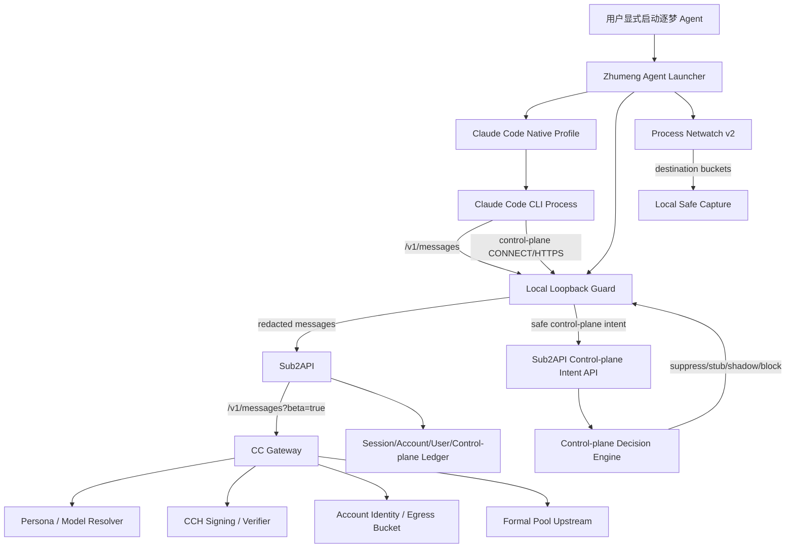

# 逐梦 Agent Claude Code Native 接管设计与实施计划

日期：2026-06-07  
状态：DRAFT v1  
Source of truth：`/Users/muqihang/chelingxi_workspace/sub2api-zhumeng-main/.worktrees/claude-antiban-implementation`

## 0. 执行结论

本阶段目标是把真实 Claude Code CLI 从“用户手工改 Base URL、行为不可控、控制面可能直连”升级为“用户通过逐梦 Agent 显式启动，Claude Code 的主消息、控制面、工具能力、进程网络目的地、本机采集与服务端账号池/审计形成闭环”的 native 接管体系。

推荐路线：

```text
真实 Claude Code CLI
  -> 逐梦 Agent launcher
  -> isolated CLAUDE_CONFIG_DIR
  -> local loopback guard
  -> Sub2API /v1/messages
  -> CC Gateway /v1/messages?beta=true internal route
  -> CC Gateway persona / CCH signing / egress bucket / raw-safe audit
  -> formal pool upstream
```

本阶段只做 Claude Code native 接管，不做 GPT / DeepSeek / 多供应商模型注入。多模型混合属于后续 `47-zhumeng-agent-multi-provider-in-claude-code-plan.md`。

## 1. 目标与非目标

### 1.1 目标

1. 用户必须通过逐梦 Agent 显式启动 Claude Code CLI，不做偷偷注入。
2. 主 messages 请求必须经过本机 loopback guard，再进入 Sub2API / CC Gateway。
3. Claude Code 控制面请求必须被分类接管：telemetry/eval、MCP/registry、bootstrap/settings、policy limits、team memory、unknown drift 等都进入中心化 safe intent 或本地 suppress/stub/block 决策。
4. 使用 V1/V2 本机采集材料和进程级 netwatch 机制，持续证明是否存在绕过 guard 的直连。
5. 修复“裸 custom Base URL 导致 Claude Code 能力差异”的问题，尤其 ToolSearch / `tool_reference` / `defer_loading` / FGTS / request id / control-plane 等。
6. 与服务端 44 号 compat adapter、41 号 shape healthcheck、36 号 dynamic persona/model resolver、39 号 session budget、40 号新号硬门禁联动。
7. 不降低 Claude Code 原生能力：1m context、tools、thinking、stream、Opus/Sonnet、`max_tokens=32000`、MCP/subagent 能力不得因为安全策略被机械阉割。
8. 全链路只记录脱敏摘要，不保存 raw token、raw prompt、raw body、raw telemetry、raw CCH、email、账号/组织 UUID、proxy credential。

### 1.2 非目标

本阶段不做：

- GPT / DeepSeek / 其他供应商模型注入 Claude Code；
- 类 Cursor 多模型混合 UI；
- 非 Claude 模型 tool-use / thinking / streaming 语义转换；
- patch Claude Code CLI 源码或篡改请求 body；
- 用 messages 的 CCH signing 逻辑伪造控制面；
- synthetic telemetry 真实上传；
- 无用户批准的真实 upstream canary；
- 全局系统代理或无提示 MITM；
- 读取、导出、上传用户本机原 Claude Pro OAuth / cookie / setup token。

### 1.3 Client Family Scope：CLI 首发，Desktop 纳入后续证据门禁

本计划的首发目标是 **Claude Code CLI native takeover**，因为当前五类材料中，真实 V1/V2 本机采集、45 号 custom Base URL 源码分析、CC Gateway shape/canary 复盘、ToolSearch/FGTS 差异、control-plane guard 证据，均围绕 CLI 链路建立。

Claude Code Desktop / Claude Desktop / 其他 Claude Code 客户端家族不能简单假设与 CLI 完全等价。即使底层可能复用部分 Anthropic messages 协议或控制面服务，它们在以下层面仍可能不同：

- 进程模型：CLI 是 shell 子进程，Desktop 可能是 Electron/WebView/原生 app 进程树；
- 认证模型：CLI 可用 `ANTHROPIC_API_KEY` / OAuth / config，Desktop 可能更多依赖浏览器态、cookie、app session；
- 代理接管方式：CLI 可以用 env + loopback guard，Desktop 可能需要 app-level proxy、系统代理、证书信任或专用 launcher；
- 控制面路径：event logging、settings、feature flag、MCP registry、team memory 等可能路径、header、节奏不同；
- 本地能力：MCP、文件权限、workspace、tool runner、subagent、插件/扩展体系可能不一致；
- 安全边界：Desktop 可能更容易触发用户隐私、cookie、web session、系统证书和全局网络代理风险。

因此本阶段做法是：

```text
Phase A: Claude Code CLI native takeover 先闭环。
Phase B: Claude Code Desktop / Claude 客户端家族 discovery-only 采集与差异矩阵。
Phase C: 证据充分后，再为 Desktop 写独立 takeover adapter 计划。
```

Desktop 家族后续必须满足同样硬门禁：

1. 用户显式通过逐梦 Agent 启动或授权接管；
2. isolated profile，不读取/上传默认浏览器或 Claude app 原始 cookie/token；
3. messages/control-plane/netwatch 三链路可观测；
4. 不保存 raw token、raw prompt、raw body、raw telemetry、raw CCH；
5. 有本机 V1/V2 等价采集、shape healthcheck、CC Gateway raw-safe audit 对照；
6. 不能因为“看起来底层通用”就直接复用 CLI 的 persona/profile 或 ToolSearch 策略。

换言之：Desktop 要考虑在产品路线内，但不能阻塞 CLI 首发闭环，也不能未经证据直接并入 CLI native path。

## 2. 材料基线：五大类证据与算法

### 2.1 CC Gateway 与服务端算法材料

关键路径：

```text
/Users/muqihang/chelingxi_workspace/cc-gateway/src/policy.ts
/Users/muqihang/chelingxi_workspace/cc-gateway/src/rewriter.ts
/Users/muqihang/chelingxi_workspace/cc-gateway/src/proxy.ts
/Users/muqihang/chelingxi_workspace/cc-gateway/src/persona-registry.ts
/Users/muqihang/chelingxi_workspace/cc-gateway/src/persona-resolver.ts
/Users/muqihang/chelingxi_workspace/cc-gateway/src/upstream-safety.ts
backend/internal/service/claude_code_compat_*.go
backend/internal/service/gateway_service.go
backend/internal/service/session_budget*.go
```

必须继承的算法边界：

- `selectSharedPoolRoute()`：CC Gateway 内部 `/v1/messages?beta=true` / count_tokens / event logging route policy。
- `canonicalPersonaHeaders()`：由可信 persona/profile 生成 header，不信任外部用户传入的 `anthropic-beta`、`x-app`、stainless、Claude Code 版本。
- `resolvePersonaDecision()`：dynamic persona/model resolver，支持 known/candidate/gray/kill switch，不能机械阻拦未来 Sonnet/Opus。
- `runSigningPipeline()` / `verifySignedCCH()`：只服务 messages sign-primary，不得复用到 control-plane。
- `resolveAccountIdentity()` / `resolveEgressBucket()`：账号身份与出口桶必须 runtime registered 且 fail closed。
- `verifySharedPoolFinalOutput()`：final upstream request verifier，检测 signing placeholder、fallback、header/body mutation。
- `rawCaptureSink`：只记录 safe payload、schema summary、header names、query keys，不记录 raw body。
- `session budget observe-only`：生产默认观测，不用 canary 低阈值限制真实 Claude Code 工具循环。

### 2.2 控制面策略材料

关键文档：

```text
docs/anti-ban/30-claude-code-control-plane-classification-strategy.md
docs/anti-ban/35-formal-pool-control-plane-upload-strategy.md
docs/anti-ban/38-formal-pool-synthetic-telemetry-strategy.md
```

必须继承的原则：

- messages 是主链路；control-plane 是独立安全域。
- telemetry/eval 首发 suppress / shadow-only，不上传 raw telemetry。
- MCP/registry/settings/bootstrap/policy/team memory 要分类 stub/block/shadow。
- unknown drift 必须 quarantine/block，并保留 safe summary。
- 所有 control-plane intent 必须通过 guard attestation，不能用 plain hash 作为安全意图。
- 控制面上传采用两段式：先 local safe intent，再 server decision；真实上游上传需单独灰度和批准。

### 2.3 本机 V1/V2 采集材料

本机采集路径：

```text
/Users/muqihang/.zhumeng/claude-code-lab/captures
```

重点材料：

```text
20260529-042841
20260530-025229
20260601-003152
20260601-194006
20260602-223311
```

当前结论：

- V1/V2 使用 `ANTHROPIC_BASE_URL=http://127.0.0.1:<guard-port>` 接管 messages。
- 仅设置 Base URL 不足以接管所有控制面；event logging / bootstrap / eval / MCP registry 等可能仍出现官方域 CONNECT 或硬编码 endpoint 形态。
- V2 `process-netwatch.jsonl` 能记录进程树 TCP destination bucket 和 `potential_guard_bypass`，但不记录 payload/header/token。
- V1/V2 不保存 raw token/prompt/body/telemetry/CCH；这正是逐梦 Agent 产品化采集策略的基线。

### 2.4 Claude Code 源码逆向材料

参考源码：

```text
/Users/muqihang/chelingxi_workspace/reference-projects/agent-frameworks/claude_code_src
```

关键模块：

```text
src/utils/model/providers.ts
src/utils/toolSearch.ts
src/services/api/claude.ts
src/utils/api.ts
src/utils/messages.ts
src/services/api/client.ts
src/services/policyLimits/index.ts
src/services/remoteManagedSettings/syncCache.ts
src/services/settingsSync/index.ts
src/services/teamMemorySync/index.ts
src/utils/model/modelCapabilities.ts
src/services/analytics/firstPartyEventLoggingExporter.ts
src/services/analytics/growthbook.ts
src/utils/betas.ts
```

核心发现见 45 号文档：custom `ANTHROPIC_BASE_URL` 会触发 first-party host gate 差异，尤其 ToolSearch、FGTS、request id、policy limits、remote settings、settings sync、team memory、model capabilities、GrowthBook 属性、event logging endpoint。

### 2.5 正式号池与运营安全材料

关键文档：

```text
docs/anti-ban/36-dynamic-claude-code-persona-version-mapping-plan.md
docs/anti-ban/39-formal-pool-session-budget-strategy.md
docs/anti-ban/40-formal-pool-new-account-hard-gates.md
docs/anti-ban/41-formal-pool-claude-code-shape-healthcheck.md
docs/anti-ban/44-non-claude-code-client-compat-adapter-design.md
```

必须继承：

- 新账号状态机：`imported -> refreshed -> runtime_registered -> healthcheck_passed -> warming -> production -> quarantined`。
- 账号/proxy/session/user/model/control-plane ledger 脱敏记录。
- P0 hard block：verifier fail、fallback、proxy mismatch、401/403/risk/hold、raw sensitive leak、unsafe control-plane upload。
- 44 号 compat adapter 已完成非 Claude Code 客户端服务端高保真兼容；逐梦 Agent 的 native path 必须与之区分。

## 3. 架构总览



三条链路必须分离：

1. `messages native path`：Claude Code CLI 真实 messages body，经 guard、Sub2API、CC Gateway sign-primary。
2. `control-plane intent path`：guard 生成 safe intent，server 决策 suppress/stub/shadow/block，不走 messages signer。
3. `local observability path`：guard-summary、netwatch、report，只保存脱敏摘要。

## 4. 逐梦 Agent 本机模块设计

### 4.1 ClaudeCodeAdapter

新增适配器模块建议：

```text
tools/zhumeng-agent/src/zhumeng_agent/adapters/claude_code/
  __init__.py
  launcher.py
  profile.py
  guard.py
  netwatch.py
  capture.py
  doctor.py
  shape_check.py
  control_plane.py
```

职责：

- 检测 `claude` 可执行文件与版本。
- 创建 isolated `CLAUDE_CONFIG_DIR`。
- 从服务端拉取 `claude_code_capability_profile`。
- 启动本机 loopback guard。
- 注入 env 并启动 Claude Code CLI。
- 启动 process netwatch。
- 生成 local safe capture report。
- 与 Sub2API / CC Gateway shape healthcheck 对齐。

### 4.2 启动模式

| 模式 | 用途 | 控制面 | 上游 | 是否生产默认 |
|---|---|---|---|---|
| `messages_only_lab` | 仅验证主链路 | 可能绕过，仅 netwatch 观察 | Sub2API | 否 |
| `egress_guard_lab` | 本机采集 V2 | stub/block | Sub2API/mock | 否 |
| `native_takeover_staging` | staging 验证 | safe intent + suppress/stub/block | staging/localhost 或小流量 | 是，上线前 |
| `native_takeover_production` | 正式用户使用 | safe intent + policy decision | production session | 是 |
| `shadow_telemetry` | 后续 telemetry shadow | safe intent + server shadow builder | 不上传 raw | 后续 |

### 4.3 启动环境变量

生产 profile 默认：

```text
CLAUDE_CONFIG_DIR=<isolated user data dir>
ANTHROPIC_BASE_URL=http://127.0.0.1:<guard-port>
CLAUDE_CODE_API_BASE_URL=http://127.0.0.1:<guard-port>
ANTHROPIC_API_KEY=<zhumeng entry api key only>
HTTP_PROXY=http://127.0.0.1:<guard-port>
HTTPS_PROXY=http://127.0.0.1:<guard-port>
NODE_EXTRA_CA_CERTS=<local guard ca cert>
ZHUMENG_CLAUDE_CAPTURE_MODE=native_takeover_production
ZHUMENG_NETWATCH_INTERVAL=2.0
```

不得：

- 从默认 `~/.claude` 读取 OAuth / cookie / setup-token。
- 把用户本机 Claude token 转发给服务器。
- 在日志中写入 `ANTHROPIC_API_KEY` 值或 proxy credential。

### 4.3.1 Inherited env allowlist / scrub

逐梦 Agent 启动 Claude Code 时不能继承用户 shell 的完整环境。必须采用 allowlist + scrub 双策略：

**允许继承或重建：**

```text
PATH
HOME
SHELL
TERM
LANG / LC_*
PWD / project cwd
SSH_AUTH_SOCK  # 仅当用户明确需要 git/ssh 工具时
```

**必须清理或由 profile 重建：**

```text
ANTHROPIC_API_KEY
ANTHROPIC_AUTH_TOKEN
ANTHROPIC_BETAS
ANTHROPIC_BASE_URL
CLAUDE_CODE_API_BASE_URL
CLAUDE_CONFIG_DIR
CLAUDE_CODE_DISABLE_EXPERIMENTAL_BETAS
ENABLE_TOOL_SEARCH
CLAUDE_CODE_ENABLE_FINE_GRAINED_TOOL_STREAMING
HTTP_PROXY / HTTPS_PROXY / ALL_PROXY / NO_PROXY
*_TOKEN / *_API_KEY / *_COOKIE / *_SESSION
proxy username/password env
```

规则：

- ToolSearch / FGTS / beta / base URL 只能由 `claude_code_capability_profile` 写入，不能信任用户 shell 里的旧值。
- `ANTHROPIC_BETAS` 不允许用户任意注入；如需 beta，由服务端 persona/profile registry 下发。
- `CLAUDE_CODE_DISABLE_EXPERIMENTAL_BETAS` 默认清理，不让用户旧环境误关 Claude Code beta shapes；仅故障降级 profile 可显式设置。
- 代理变量由 guard 管理。guard 自身出站必须使用独立 upstream client 配置，并设置 guard process 的 `NO_PROXY=127.0.0.1,localhost`，防止 loopback recursion。

### 4.4 Capability profile

服务端下发并由本机执行：

```text
profile_id
claude_code_version_family
persona_profile_id
tool_search_mode
fgts_mode
control_plane_policy_version
capture_level
netwatch_required
server_shape_healthcheck_version
kill_switches
```

首发建议：

| 字段 | 默认 | 说明 |
|---|---|---|
| `tool_search_mode` | `auto` 或 `true_after_healthcheck` | 裸 custom Base URL 会默认关闭；必须由 Agent 管理 |
| `fgts_mode` | `observe_only` | custom Base URL 下 env 不一定能打开；不首发硬补 |
| `control_plane_policy_version` | 来自 30/35 | 分类策略可审计 |
| `capture_level` | `summary` 生产；`deep` 诊断 | 不保存 raw |
| `netwatch_required` | true | 用于发现 guard bypass |

## 5. Loopback Guard 设计

### 5.1 职责

本机 guard 是逐梦 Agent 的核心边界，负责：

- 接收 Claude Code CLI 的 `/v1/messages`、`/v1/messages?beta=true`、`/v1/messages/count_tokens`。
- 删除本机 Authorization / x-api-key / Cookie / Proxy-Authorization。
- 注入逐梦入口认证。
- 生成 safe request summary。
- 转发 messages 到 Sub2API。
- 捕获 HTTPS CONNECT / control-plane 请求并分类。
- 生成 guard attestation，提交 safe control-plane intent。
- 对 unknown/direct bypass 进行 fail closed 或 quarantine。

### 5.2 主 messages path

允许：

```text
POST /v1/messages
POST /v1/messages?beta=true
POST /v1/messages/count_tokens   # 仅 native profile 和 route policy 允许时
```

策略：

- 不修改 CLI body。
- 不删除合法 ToolSearch / `tool_reference` / `defer_loading` / thinking / context_management / output_config。
- 不限制 `max_tokens=32000`。
- 不限制 tools 数量，不使用 canary `max_messages=1`。
- 只记录 safe summary：route、header names、model、body keys、body size、tools_count、messages_count、thinking/context flags、status code bucket。

### 5.3 Control-plane path

控制面分类：

| Bucket | 例子 | 首发动作 | 备注 |
|---|---|---|---|
| telemetry/eval | event logging batch, eval | suppress/shadow | 不上传 raw telemetry |
| bootstrap/settings | bootstrap, remote settings, feature flags | stub/safe intent | 不能泄露本机用户/团队设置 |
| policy limits | policy limits | stub/safe intent | 不直连官方 |
| MCP/registry | MCP registry/server metadata | stub/block/shadow | 不能跨账号混淆 |
| team memory/settings sync | team memory/settings sync | block/shadow | 高风险内容 |
| unknown | 未知域/路径 | block/quarantine | 记录 safe drift summary |

控制面绝不复用 CCH signing。控制面如需后续上传，必须走 doc 35/38 的 two-stage safe intent / synthetic shadow / gray canary。

正式号池 B2 控制面路径矩阵必须进入执行基线，不能长期把所有控制面都简单 suppress：

| Path family | 首发动作 | B2 安全升级条件 | 禁止行为 |
|---|---|---|---|
| bootstrap / feature flags | stub + safe intent | selected pool account、schema allowlist、cache、no raw | 不透传本机 token/cookie |
| policy limits | stub + safe intent | GET-only、account scoped cache、safe response schema | 不上传 raw account/user identity |
| public MCP registry | stub/block + safe intent | public registry allowlist、cache、no credentials | 不跨账号复用私有 registry |
| MCP servers metadata | block/shadow | per-user/per-account scoped cache、schema allowlist | 不上传本机 private server config |
| settings / team memory | block/shadow | 后续单独策略 | 不上传 raw settings/memory |
| telemetry / eval | suppress/shadow | synthetic telemetry builder 通过后灰度 | 不上传 raw telemetry |
| unknown drift | block/quarantine | 人工审查后新增策略 | 不 fallback 直连 |

CP0 baseline memo 必须把该矩阵落实到配置项：`action`、`cache_scope`、`schema_allowlist`、`ttl`、`quarantine_on_mismatch`、`raw_forbidden=true`。

### 5.4 Guard attestation

使用现有：

```text
tools/cli_guard_attestation.py
tools/cli_control_plane_intent.py
```

要求：

- intent 包含 route template、method、host bucket、body schema summary、header names、auth presence shape、event names、安全 refs。
- attestation 使用 HMAC/nonce/timestamp 防重放。
- 禁止 plain hash 作为唯一安全意图。
- server 必须校验 attestation 后才接受 control-plane intent。

## 6. Custom Base URL 能力差异修复策略

本阶段核心是吸收 45 号文档发现，不让用户裸改 Base URL 导致能力降级。

### 6.1 ToolSearch / tool_reference / defer_loading

问题：custom Base URL 下 Claude Code 默认可能关闭 ToolSearch，导致：

- ToolSearchTool 被过滤；
- ToolSearch beta header 缺失；
- `defer_loading` 不进入工具 schema；
- 历史 `tool_reference` 被 strip。

策略：

1. 逐梦 Agent 不能依赖 unset 默认值。
2. 首发使用 `ENABLE_TOOL_SEARCH=auto` 作为保守 profile；对通过 fixed MCP/deferred-tool shape healthcheck 的版本/profile，可升级到 `ENABLE_TOOL_SEARCH=true`。
3. 本地 doctor 必须检查：是否存在 MCP/deferred tools、pending MCP server、disallowed tools、模型是否支持 tool_reference。
4. Sub2API / CC Gateway 不能把 `tool_reference` / `defer_loading` 当异常字段清理。
5. 若上游/CC Gateway 出现 ToolSearch 相关 400，降级 profile 并记录 risk_event，不重试刷请求。

### 6.2 Fine-grained tool streaming / eager_input_streaming

问题：源码要求 first-party host，custom Base URL 下即使设置 env 也可能无法自然开启。

策略：

- 首发 `fgts_mode=observe_only`。
- 不为了 FGTS 伪装 official host。
- 若要做 official-host-equivalent 实验，必须另开隔离阶段：official CONNECT fail-closed、control-plane route policy 完备、isolated config、no local token upload。
- CC Gateway 可以在 server-filled compat path 记录 FGTS intent，但 native path 不应随意补字段。

### 6.3 x-client-request-id

问题：custom Base URL 下 CLI 可能不注入。

策略：

- 本机可生成 local trace ref，但不冒充 CLI 原生 request id。
- CC Gateway 使用 internal request ref / raw capture ref 对齐。
- 是否上游补 header 由 persona registry + field parity audit 决定，不在本阶段默认启用。

### 6.4 Policy limits / settings / team memory / model capabilities

问题：custom Base URL 下多类 first-party-host 控制面不启用或不跟随 Base URL。

策略：

- 不让本机直连官方。
- guard 记录 safe intent 和 route summary。
- 首发 suppress/stub/shadow-only。
- 后续 synthetic telemetry/control-plane upload 依据 doc 35/38 单独灰度。

### 6.5 GrowthBook / event logging

问题：45 号材料确认，GrowthBook 会把 custom base host 作为属性参与 feature gate；event logging 不会简单跟随任意 `ANTHROPIC_BASE_URL`，可能继续出现官方域控制面 endpoint。

策略：

- Guard 记录 GrowthBook / event logging 的 safe intent：route template、host bucket、event name 枚举、body size bucket、schema summary、header names、auth presence shape。
- 不保存 raw GrowthBook attributes，不保存 raw event body，不保存用户 email/account/org UUID。
- 将 GrowthBook feature-gate 差异纳入 shape healthcheck：同一 Claude Code version 下比较 custom base / Agent profile 的 ToolSearch、FGTS、request-id、control-plane route summary。
- 若出现新的 GrowthBook-controlled capability drift，profile resolver 必须进入 `candidate_review` 或 `kill_switch`，不能自动放行。
- event logging 首发只允许 suppress / shadow-only；真实上传必须等待 synthetic telemetry 策略单独实现、审查和灰度批准。

### 6.6 1m / thinking / Opus/Sonnet

当前没有证据表明 custom Base URL 直接关闭 1m 或 thinking。

策略：

- 不因 custom Base URL 误关 1m 或 thinking。
- 不把 thinking block 当异常拦截。
- Opus 4.x、Sonnet 4.x 以及未来 4.8 走 dynamic model resolver candidate/gray，不机械挡。
- 健康检查短请求不要强制 long context；1m 专项另测。

## 7. 与 Sub2API / CC Gateway 的联动

### 7.1 ClientType 与信任边界

逐梦 Agent native path 必须与 44 compat path 区分：

| 路径 | client_type | 来源 | 服务端处理 |
|---|---|---|---|
| 非 CLI Anthropic 客户端 | `claude_code_compat` | server-filled shape | 44 compat adapter |
| 逐梦 Agent 启动的真实 Claude Code | `claude_code_native` | guard attested native CLI | 保留 CLI body，CC Gateway sign-primary |
| 未证明来源的 beta 请求 | `untrusted_beta` | 外部 | strip/reject/fail closed |

### 7.2 Header / audit markers

由本机 guard 或 Sub2API 添加内部标记，仅内部使用，不上游透传：

```text
x-sub2api-client-type=claude_code_native
x-sub2api-guard-attested=true
x-sub2api-guard-version=<safe version>
x-sub2api-claude-code-version=<safe version family>
x-sub2api-local-session-ref=<opaque ref>
x-sub2api-netwatch-required=true
```

CC Gateway raw/audit 记录：

```text
client_type
native_attested
local_session_ref
inbound_route
cc_gateway_route
persona_decision
model_decision
tool_search_mode
tool_reference_present
defer_loading_present
eager_input_streaming_present
shape_healthcheck_profile
raw_capture_ref
verifier_summary
egress_bucket
account_ref
```

### 7.3 Shape healthcheck

新增 native healthcheck profile：

```text
real_claude_code_native_takeover_v1
real_claude_code_native_toolsearch_v1
real_claude_code_native_control_plane_shadow_v1
real_claude_code_native_netwatch_v1
```

必须覆盖：

- no tools / simple prompt；
- tools + thinking；
- MCP/deferred tools；
- ToolSearch true/auto/standard；
- count_tokens；
- stream；
- Opus/Sonnet；
- custom Base URL A/B；
- guard bypass detection；
- control-plane safe intent；
- GrowthBook / event logging safe summary；
- no stale healthcheck evidence。

### 7.4 新号 real-client directed healthcheck 衔接

逐梦 Agent native run 不能被实施代理误用为“新账号准入已通过”。新号准入必须沿用 41/40 号硬门禁：

1. 使用后台显式触发的 temporary healthcheck key，不使用普通用户 API key。
2. single-account pin：健康检查必须命中指定 account_id，不允许调度器换号。
3. 必须经过 Sub2API -> CC Gateway，并生成完整 evidence：`cc_gateway_seen=true`、`raw_capture_present=true`、`account_ref`、`egress_bucket`、`verifier_summary`。
4. no stale evidence：不能复用旧 raw_capture_ref、旧 healthcheck_status 或旧 runtime registration。
5. 200 成功后只进入 `healthcheck_passed`，仍不可生产调度。
6. `start_warming` 是独立动作；warming 低权重、normal-only。
7. `promote_production` 只允许从 warming 且观察窗口通过后执行。
8. 401/403/egress_proxy_failure/missing_account_identity/risk text 必须 quarantine，不 retry loop。

Native takeover 的 shape healthcheck 可以为新号健康检查提供 client profile，但不能替代新号状态机。

### 7.5 Session/account budget

逐梦 Agent 不做本机低阈值 hard block。

- production 默认 session budget observe-only。
- 只 hard block P0：verifier fail、fallback、proxy mismatch、401/403/risk/hold、unsafe control-plane、raw sensitive leak、direct Anthropic bypass。
- normal/aggressive pool 只影响调度权重，不限制 Claude Code 单 session 工具循环能力。

## 8. 本机数据留存与隐私边界

### 8.1 文件目录

生产化建议：

```text
~/.zhumeng/claude-code-native/
  config/
  captures/<YYYYmmdd-HHMMSS>/
    guard-summary.jsonl
    process-netwatch.jsonl
    run-metadata.json
    report.json
    report.md
    README.md
```

诊断模式可继续复用：

```text
~/.zhumeng/claude-code-lab/captures
```

### 8.2 允许记录

- route/method/status；
- header names；
- auth presence shape；
- body keys；
- schema tree / type / length / array counts；
- model name；
- max_tokens 数值；
- tools_count；
- thinking/context/output_config 是否存在；
- control-plane route template；
- telemetry event name 枚举；
- netwatch destination bucket；
- scoped opaque refs。

### 8.3 禁止记录

- raw token / API key / OAuth / cookie / setup-token；
- raw prompt；
- raw body；
- raw telemetry；
- raw CCH；
- email；
- account/org UUID 明文；
- proxy credential；
- 本机文件内容或项目私密路径，除非 bucket/ref 化。

### 8.4 文件权限

- capture 根目录：700；
- 文件：600；
- 本机 local-raw 只允许诊断显式打开，不进入 git，不上传服务器。

## 9. Fail-closed 策略

必须 fail closed 的情况：

1. Guard 未启动或端口不是 loopback。
2. Claude Code 未使用 isolated `CLAUDE_CONFIG_DIR`。
3. `ANTHROPIC_BASE_URL` 未指向本机 guard。
4. 发现 `api.anthropic.com` / `platform.claude.com` / `claude.ai` direct egress bypass。
5. control-plane unknown drift。
6. Sub2API / CC Gateway runtime 不支持当前 persona/profile。
7. CC Gateway verifier fail / fallback / signing strip。
8. egress proxy mismatch 或 unavailable。
9. 401/403/risk/hold。
10. sensitive scan 检测到 raw sensitive artifact。

失败动作：

- 停止当前 Claude Code 启动或提示重启接管模式；
- 标记 local session risk；
- 服务器写 risk_event；
- 必要时隔离账号；
- 不自动重试真实上游请求。

## 10. 实施 Checkpoint 计划

### CP0：材料审计与基线冻结

边界：localhost/mock only，不发真实 Anthropic/Claude 请求。

任务：

- 汇总 45、V1/V2 captures、CC Gateway、control-plane、44 compat、session budget 材料。
- 输出 native takeover baseline memo。
- 明确不做多模型注入。

验收：

- sensitive scan PASS。
- 审查代理 APPROVED。
- commit。

### CP1：逐梦 Agent ClaudeCodeAdapter 骨架

边界：localhost/mock only，不发真实 Anthropic/Claude 请求。

任务：

- 新增 adapter 包结构。
- 实现 version detection、profile dataclass、isolated config path builder、safe env builder。
- 不启动真实 Claude Code。

测试：

- env builder 不包含本机 token；
- base URL 必须 loopback；
- config dir 与默认 `~/.claude` 隔离。

### CP2：Loopback guard 产品化封装

边界：localhost/mock only，不发真实 Anthropic/Claude 请求。

任务：

- 把现有 `tools/claude_code_lab_capture.py` / `cli_control_plane_guard.py` 能力封装为逐梦 Agent native mode。
- 支持 production/staging/lab 三种 mode。
- 生成 guard attestation。

测试：

- messages 转发路径；
- control-plane stub/block；
- auth/header redaction；
- nonloopback/official upstream forbidden；
- CONNECT 不建立真实隧道；
- direct `/v1/messages` via CONNECT block；
- query/path 变体 fail closed；
- invalid guard config 启动失败；
- guard 自身 upstream 不走自身 loopback 代理，避免 recursion。

### CP3：Process netwatch v2 接入

边界：localhost/mock only，不发真实 Anthropic/Claude 请求。

任务：

- 将 `claude_code_lab_netwatch.py` 产品化为 Agent 子模块。
- 记录 process tree destination buckets。
- 提供 bypass summary。

测试：

- loopback 不算 bypass；
- public/Anthropic bucket 算 potential bypass；
- 不记录 payload/header。

### CP4：Capability profile 与 ToolSearch 策略

边界：localhost/mock only，不发真实 Anthropic/Claude 请求。

任务：

- 实现 `claude_code_capability_profile`。
- 支持 ToolSearch auto/true/standard。
- 实现 doctor：MCP/deferred tools、model support、disallowed tools、profile compatibility。

测试：

- custom Base URL 默认不依赖 unset；
- `ENABLE_TOOL_SEARCH=true` 只在 healthcheck 通过后允许；
- Haiku/subagent/tool_reference 不支持场景 safe fallback。

### CP5：Sub2API / CC Gateway native attestation 集成

边界：localhost/mock only，不发真实 Anthropic/Claude 请求。

任务：

- Sub2API 识别 guard-attested native path。
- CC Gateway 审计 native markers。
- 与 44 compat path 区分。
- 落地 B2 control-plane path matrix 的配置接口：safe GET/cache/schema allowlist/quarantine/no raw。
- 明确 native takeover 与新号 real-client directed healthcheck 的 temporary key、single-account pin、evidence freshness 边界。

测试：

- `claude_code_native` 不走 server-filled shape；
- `claude_code_compat` 不冒充 native；
- untrusted beta fail closed。

### CP6：Native shape healthcheck fixtures

边界：localhost/mock only，不发真实 Anthropic/Claude 请求。

任务：

- 增加 native takeover fixture。
- 覆盖 ToolSearch、thinking、tools、count_tokens、stream、Opus/Sonnet、control-plane safe intent、netwatch。

测试：

- localhost-only；
- mock upstream；
- no real Anthropic。

### CP7：UI / Runbook / Operator 状态

边界：localhost/mock only，不发真实 Anthropic/Claude 请求。

任务：

- 逐梦 Agent CLI/UI 展示 Claude Code 接管状态：ready、running、guard_bypass、profile_mismatch、toolsearch_degraded、quarantined。
- 输出 runbook。

文档：

```text
docs/anti-ban/46-zhumeng-agent-claude-code-native-takeover-runbook.md
```

### CP8：最终验证与审查

边界：localhost/mock only，不发真实 Anthropic/Claude 请求。

任务：

- Python tests；
- Go targeted tests；
- CC Gateway tests；
- sensitive scan；
- 审查代理系统审查。

所有 checkpoint 都必须：

- 主控自查；
- 跑相关测试；
- 派审查代理；
- 审查通过再进入下一 checkpoint；
- commit；
- 关闭不再使用的子代理。

## 11. 测试计划

### 11.1 Python / Agent tests

```bash
cd /Users/muqihang/chelingxi_workspace/sub2api-zhumeng-main/.worktrees/claude-antiban-implementation/tools/zhumeng-agent
python -m pytest tests -q
```

新增测试：

- `test_claude_code_launcher.py`
- `test_claude_code_profile.py`
- `test_claude_code_guard.py`
- `test_claude_code_netwatch.py`
- `test_claude_code_capture.py`
- `test_claude_code_toolsearch_profile.py`

### 11.2 Sub2API tests

```bash
cd /Users/muqihang/chelingxi_workspace/sub2api-zhumeng-main/.worktrees/claude-antiban-implementation/backend
go test ./internal/service ./internal/handler ./internal/server/routes -run 'ClaudeCode|Native|Guard|ControlPlane|Compat|Shape|Gateway|Session|Account' -count=1 -timeout=240s
```

### 11.3 CC Gateway tests

```bash
cd /Users/muqihang/chelingxi_workspace/cc-gateway
npm run build
npm test -- --runInBand
```

### 11.4 Sensitive scan

```bash
cd /Users/muqihang/chelingxi_workspace/sub2api-zhumeng-main/.worktrees/claude-antiban-implementation
python3 tools/safe_deliverable_sensitive_scan.py --max-findings 100
```

### 11.5 Localhost-only A/B

不发真实请求：

1. 官方-like env baseline：只用于本机 mock，不直连官方。
2. custom base裸模式：证明能力差异。
3. 逐梦 Agent native profile：证明 ToolSearch/control-plane/netwatch 改善。

## 12. 风险与缓解

| 风险 | 级别 | 缓解 |
|---|---:|---|
| control-plane direct bypass | P0 | egress guard + netwatch + fail closed |
| 本机 token 泄漏 | P0 | isolated config + header strip + no raw + sensitive scan |
| ToolSearch 被误关 | P1 | profile 管理 + shape healthcheck + doctor |
| FGTS 不能恢复 | P2 | observe-only，不作为首发硬目标 |
| 误把 compat 当 native | P1 | client_type/attestation-first |
| 账号/代理错配 | P0 | runtime identity + egress bucket + verifier |
| unknown Claude Code 版本漂移 | P1 | version resolver candidate/gray/kill switch |
| 过度限制工具循环 | P1 | session budget observe-only，P0 only hard block |
| synthetic telemetry 过早上传 | P0 | 本阶段不上传，只 shadow/suppress |

## 13. Acceptance Criteria

完成后必须满足：

1. 逐梦 Agent 能显式启动 isolated Claude Code CLI。
2. `ANTHROPIC_BASE_URL` 指向本机 loopback guard。
3. 本机默认 `~/.claude` 不被修改、不读取、不上传。
4. messages 经过 guard -> Sub2API -> CC Gateway。
5. control-plane 被分类并生成 safe intent，不复用 messages signer。
6. process netwatch 可检测 guard bypass。
7. ToolSearch / `tool_reference` / `defer_loading` 有 profile 管控和 healthcheck。
8. 不因 custom Base URL 误关 1m、thinking、Opus/Sonnet、stream、tools、`max_tokens=32000`。
9. `claude_code_native` 与 `claude_code_compat` 清晰区分。
10. 不保存 raw token/prompt/body/telemetry/CCH/email/account UUID/proxy credential。
11. sensitive scan findings=0。
12. 所有相关 Python/Go/CC Gateway tests PASS。
13. 未经批准不得发真实 Anthropic/Claude 请求。

## 14. 后续阶段预留：多模型混合注入

本阶段只预留接口，不实施：

```text
provider_profile=claude_native
multi_provider_in_claude_code_enabled=false
future_provider_profiles=[openai_compat_future, deepseek_compat_future]
```

第二阶段再设计：

```text
docs/anti-ban/47-zhumeng-agent-multi-provider-in-claude-code-plan.md
```

## 15. 结论

44 号服务端 compat adapter 已完成，解决了“非 Claude Code Anthropic 客户端如何接入”的问题。46 号计划解决的是“真实 Claude Code CLI 如何被本机安全 native 接管”。

两者合流后，系统形态是：

```text
非 Claude Code 客户端 -> 44 compat adapter -> CC Gateway
真实 Claude Code CLI -> 逐梦 Agent native takeover -> Sub2API -> CC Gateway
```

这使逐梦能够同时覆盖普通 Anthropic 协议客户端和真实 Claude Code CLI，并且在能力不降级、控制面可观测、安全可回滚、账号池可运营的前提下进入下一阶段。
