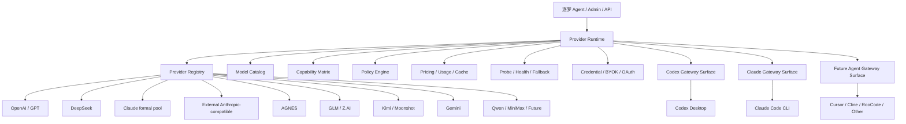

# 53. Provider Runtime Foundation 架构方案

日期：2026-06-18  
状态：讨论稿 / 设计评审版  
关联主线：Codex Gateway、47 号 Claude Code CLI 多模型托管 Runtime、逐梦 Agent 本地化与后续 BYOK/OAuth

## 0. 执行结论

逐梦 Agent 的长期竞争力不应停留在“给某一个工具换 Base URL”。我们已经有 Codex Gateway，也正在推进 Claude Code CLI 接管；未来还可能接管 Cline、RooCode、Cursor、Gemini CLI 或其它 Agent 工具。如果每接管一个工具都重新做一遍 DeepSeek、GPT、Claude、AGNES、GLM、Kimi、MiniMax、Qwen、Gemini 等模型适配，就会重复造轮子，维护成本会失控。

建议建设 **Provider Runtime Foundation**：

```text
Provider Runtime 负责模型世界：
  provider、model、协议、能力、计费、缓存、健康、路由、安全、BYOK/OAuth

Surface Gateway 负责工具原生体验：
  Codex Gateway、Claude Gateway、未来 Cursor/Cline/RooCode Gateway
```

这不是推翻 Codex Gateway / Claude Gateway，也不是简单复制 OpenRouter。正确方向是：

1. 保留 Codex Gateway / Claude Gateway 的 surface 专项能力；
2. 把 provider 通用事实和通用策略逐步下沉为 Provider Runtime；
3. 用 Provider Runtime 支撑统一模型管理、统一计费、自动路由、fallback、未来 Fusion / 多模型委员会；
4. 不牺牲现有 Codex/DeepSeek/Claude/AGNES 调优和 Claude formal pool 安全。

首版不要做大重构，不要先做 Fusion。首版只做 **统一事实来源 + 只读/旁路接入**，让 Codex Gateway 与 Claude Gateway 都能读取同一个 provider/model/capability/policy catalog，并通过测试证明不改变现有请求路径。

## 1. 背景与动机

### 1.1 当前问题

当前系统已经形成多条强能力线：

- Codex Gateway：面向 Codex Desktop，重点是 OpenAI Responses、Codex App.Server 语义、Computer Use、模型路由、DeepSeek/Claude/AGNES/GPT 调优。
- Claude Gateway / 47 号计划：面向 Claude Code CLI，重点是 Anthropic Messages、ToolSearch、Subagents、Workflow、Claude formal pool 安全、DeepSeek/GPT/GLM/Kimi bridge。
- CC Gateway / formal pool：面向 Claude 订阅账号安全，关注 native persona、CCH、session budget、attestation、行为预算。
- 逐梦 Agent：面向本地注入、接管、UI、未来本地 provider 管理和 BYOK/OAuth。

这些主线都要使用“模型厂商、模型能力、协议选择、计费、缓存、路由、健康状态、账号策略”这些共通信息。如果这些信息分散在各个 Gateway 里，后续会出现：

- 新增一个模型要改多个地方；
- DeepSeek 在 Codex Gateway 和 Claude Gateway 里能力声明不一致；
- pricing / cache / usage 统计口径不一致；
- BYOK/OAuth 未来下放到本地时很难复用云端代码；
- Auto Router / Fusion 必须重复实现多次；
- 接管新工具时又要从头写 provider 适配。

### 1.2 为什么 OpenRouter 值得借鉴但不能照搬

OpenRouter 的价值在于统一入口、统一模型 slug、provider routing、fallback、auto router，以及最近的 Fusion / 多模型 deliberation。官方文档里 Fusion Router 是把多模型 deliberation 包装成一个 model slug：多个模型并行回答，judge model 比较并输出 consensus、contradictions、coverage gaps、unique insights、blind spots，再供最终模型综合。Auto Router 则偏向按请求自动选模型。

这些思路对逐梦有价值，但逐梦不能只做普通 OpenRouter clone，因为逐梦额外要解决：

- Codex Desktop 的 Responses / App.Server / Computer Use 原生体验；
- Claude Code CLI 的 Anthropic Messages / ToolSearch / Subagents / Workflow 原生体验；
- Claude formal pool 账号安全，不能把外部 Anthropic-compatible 流量误当 native；
- 本地逐梦 Agent 注入和未来本地化 provider runtime；
- 多模型协作中的 transcript boundary、cache determinism、provider-private state 隔离。

因此，目标不是“一个 URL + API Key 代理所有模型”那么简单，而是：

```text
OpenRouter 式统一模型底座
+
Codex / Claude Code / 未来 Agent 工具的原生接管能力
```

## 2. 目标与非目标

### 2.1 目标

1. 定义统一 Provider Runtime 领域模型，覆盖 provider、model、protocol、capability、route、credential、billing、cache、health、policy。
2. 让 Codex Gateway 和 Claude Gateway 可以共享同一个模型事实来源，而不是各自硬编码模型能力。
3. 保留 surface 专项能力：Codex Gateway 继续负责 Codex Desktop 语义，Claude Gateway 继续负责 Claude Code CLI 语义。
4. 为后续 Auto Router、Fallback Router、Fusion / 多模型委员会预留接口。
5. 为后续本地逐梦 Agent provider 管理、用户 BYOK、OpenAI OAuth、Anthropic OAuth、企业 provider 下发预留接口。
6. 明确 Claude formal pool 与外部 Anthropic-compatible provider 的强隔离。
7. 设计渐进迁移路线，首版不破坏现有 Codex Gateway / Claude Gateway / CC Gateway 调优。

### 2.2 非目标

首版 Provider Runtime Foundation 不做：

- 不立即替换 Codex Gateway 的请求执行路径；
- 不立即替换 Claude Gateway 的请求执行路径；
- 不立即实现 Fusion / 多模型委员会；
- 不立即实现完整 Auto Router；
- 不立即实现本地 BYOK/OAuth UI；
- 不把 Claude formal pool 当普通 Anthropic-compatible provider；
- 不为了架构优雅重写现有稳定 provider adapter。

## 3. 分层架构



核心原则：

```text
Provider Runtime = 模型事实与策略中台
Surface Gateway = 工具协议与原生体验适配层
```

## 4. 协议模型

市场上的大模型协议大致收敛到几个族：

| Protocol family | 典型场景 | 注意点 |
|---|---|---|
| OpenAI Chat Completions | 大量 OpenAI-compatible 国产模型 | 兼容度高，但不等于支持 Responses / Computer Use / provider cache |
| OpenAI Responses | Codex Desktop / 新 OpenAI 工具语义 | 很多兼容厂商未完整支持，需要 facade/adapter |
| Anthropic Messages | Claude Code CLI / Claude-compatible provider | 兼容 Anthropic 不等于 Claude formal-pool native |
| Gemini native | Gemini 原生 generateContent / streamGenerateContent | Google 也有 OpenAI compatibility，但官方仍建议非迁移场景直接用 Gemini API |
| Provider special | AGNES / Bedrock / Antigravity / future | 必须用 capability probe 和 adapter truthfulness 约束 |

Provider Runtime 不应假设“兼容某协议 = 能力完整”。必须把 protocol 与 capability 分开：

```text
protocol_family: anthropic_messages
capabilities:
  tool_use: true
  stream_sse_shape: anthropic_compatible_partial
  provider_reasoning: true
  claude_style_thinking: false
  prompt_cache: observable | inferred | none
  context_window: measured_or_declared
```

## 5. 核心领域模型

### 5.1 Provider

```json
{
  "provider_id": "deepseek",
  "display_name": "DeepSeek",
  "provider_owner": "zhumeng_managed",
  "credential_scope": "provider_pool",
  "gateway_location": "cloud",
  "supported_protocols": ["openai_chat", "anthropic_messages"],
  "health_policy": "probe_required",
  "billing_profile": "deepseek_v4",
  "risk_profile": "external_non_formal"
}
```

### 5.2 Model

```json
{
  "model_id": "deepseek-v4-pro",
  "provider_id": "deepseek",
  "display_name": "DeepSeek V4 Pro",
  "family": "deepseek-v4",
  "visibility": "public",
  "default_surface_profiles": {
    "codex_gateway": {
      "preferred_protocol": "openai_responses_facade",
      "fallback_protocol": "openai_chat"
    },
    "claude_gateway": {
      "preferred_protocol": "anthropic_messages",
      "fallback_protocol": "openai_chat_to_anthropic_facade"
    }
  },
  "capability_profile_id": "deepseek_v4_pro_cap_v1",
  "pricing_profile_id": "deepseek_v4_pricing_v1",
  "cache_profile_id": "deepseek_v4_cache_v1"
}
```

### 5.3 CapabilityProfile

```json
{
  "capability_profile_id": "deepseek_v4_pro_cap_v1",
  "tool_use": "supported",
  "streaming": "supported",
  "anthropic_messages": "probe_passed",
  "openai_chat": "probe_passed",
  "openai_responses": "facade_required",
  "reasoning": "provider_reasoning_not_native_replayable",
  "image_input": false,
  "computer_use": "surface_policy_required",
  "context_window": 128000,
  "prompt_cache": "provider_specific_observable",
  "transcript_replay_policy": "foreign_to_claude_requires_summary"
}
```

### 5.4 SurfaceProfile

SurfaceProfile 描述同一个模型在不同工具面上的最佳接入方式：

```json
{
  "surface": "claude_gateway",
  "model_id": "deepseek-v4-pro",
  "preferred_transport": "anthropic_compatible_v1_messages",
  "fallback_transport": "openai_chat_to_anthropic_facade",
  "tool_stream_policy": "anthropic_sse_required",
  "transcript_policy": "replay_safe_anthropic_transcript",
  "formal_pool_eligible": false
}
```

同一个模型在 Codex Gateway 里可以走 OpenAI Responses facade，在 Claude Gateway 里优先走 Anthropic Messages。这是 Provider Runtime 必须支持的核心能力。

### 5.5 RoutePolicy

```json
{
  "route_id": "claude_code_bridge_deepseek",
  "surface": "claude_gateway",
  "provider_id": "deepseek",
  "formal_pool_eligible": false,
  "allowed_credential_scopes": ["provider_pool", "user_byok", "enterprise_managed"],
  "forbidden_client_types": ["claude_code_native"],
  "audit_class": "bridge_non_formal"
}
```

### 5.6 CredentialPolicy

CredentialPolicy 要强制区分：

| 类型 | 示例 | 是否可进 formal pool |
|---|---|---:|
| zhumeng_formal_pool | 逐梦托管 Claude 订阅账号 | 是，但需 attestation/persona/budget |
| zhumeng_provider_pool | 逐梦托管 DeepSeek/GPT/AGNES 等 API | 否 |
| user_byok | 用户本地 API Key | 否 |
| user_oauth_openai | 用户自有 OpenAI OAuth | 否 |
| user_oauth_anthropic | 用户自有 Anthropic OAuth | 否，除非另做 formal onboarding |
| enterprise_managed | 企业自有 provider | 默认否 |

## 6. 与现有 Gateway 的关系

### 6.1 Codex Gateway

Codex Gateway 继续负责：

- Codex Desktop 入口；
- OpenAI Responses / App.Server.v2 语义；
- Computer Use 高保真语义压缩；
- GPT 原生体验保护；
- Codex model list / model picker；
- Codex Desktop 相关 cache、stream、error、previous_response_id、tool 语义。

Provider Runtime 可逐步下沉：

- model catalog；
- provider capability；
- pricing/cache metadata；
- DeepSeek / AGNES / Gemini / GLM / Kimi provider facts；
- provider health / fallback；
- usage accounting 统一口径。

### 6.2 Claude Gateway / 47 号计划

Claude Gateway 继续负责：

- Claude Code CLI 入口；
- Anthropic Messages façade；
- ToolSearch、Subagents、Workflow、compact/title/background fast model；
- ReplaySafeAnthropicTranscript；
- route hint / guard / native attestation；
- Claude formal pool 号池安全。

Provider Runtime 可提供：

- Claude Code surface 下每个模型的 preferred transport；
- DeepSeek/GLM/Kimi Anthropic-compatible probe 结果；
- bridge model catalog；
- non-formal route policy；
- pricing/cache/accounting；
- fallback transport decision。

### 6.3 CC Gateway / formal pool

Formal pool 不能被 Provider Runtime “普通化”。它必须是 Provider Runtime 中的特殊 credential/policy class：

```text
provider_owner=zhumeng_managed
credential_scope=formal_pool
route=claude_code_native
requires native attestation + persona + shape verifier + budget
```

任何 external Anthropic-compatible provider，即使模型名叫 Claude，也默认不是 formal pool native。

## 7. Auto Router 设计方向

Auto Router 应是 Provider Runtime v2，不是 v1。

### 7.1 输入信号

- task type：coding、review、research、debug、computer-use、planning；
- surface：Codex / Claude Code / future；
- required capabilities：tool_use、image、long_context、reasoning、computer_use；
- latency budget；
- cost budget；
- cache affinity；
- provider health；
- user plan / quota；
- formal pool availability；
- transcript safety constraints。

### 7.2 输出

```json
{
  "selected_model": "deepseek-v4-flash",
  "selected_provider": "deepseek",
  "selected_surface_transport": "anthropic_compatible_v1_messages",
  "reason": "fast coding subtask, tool_use required, low latency, no formal-pool use",
  "fallback_chain": ["deepseek-v4-pro", "gpt-5.4", "claude-sonnet-4.6"]
}
```

### 7.3 不适合 Auto 的场景

- 正在进行 Claude native formal-pool turn，不能中途擅自换 provider；
- 有 provider-private state 的同 provider 长会话；
- 需要严格可复现计费/审计的任务；
- 用户显式锁定模型；
- 需要保证 GPT 原生体验或 Claude native shape equality 的路径。

## 8. Fusion / 多模型委员会设计方向

Fusion 应是 Provider Runtime v3，不是 v1。

### 8.1 适用场景

适合：

- 架构方案评审；
- 代码审查；
- 安全边界评估；
- 复杂 bug root cause；
- 产品策略；
- 多模型交叉验证；
- 高风险上线前审查。

不适合默认用于：

- 每个 agent turn；
- 高频工具调用；
- 低延迟聊天；
- cache-sensitive native Claude Code 连续会话；
- Computer Use 每一步。

### 8.2 Fusion 流程

```text
User task
  -> Fusion Planner 选择 panel models
  -> 并行调用 panel models
  -> Judge 比较：共识 / 矛盾 / 缺口 / 独特观点 / 风险
  -> Synthesizer 生成最终答案
  -> Surface Gateway 渲染为当前工具可消费结果
```

### 8.3 安全边界

Fusion 不能把 panel 模型的 hidden reasoning 原样拼接回 Claude native transcript。所有 panel 输出默认都是 foreign evidence summary。若 Fusion 运行在 Claude Code CLI 内，返回给 Claude 主控的只能是 safe final answer / evidence summary / structured findings。

### 8.4 Fusion 作为虚拟模型

Provider Runtime 可以把 Fusion 暴露成虚拟模型：

```json
{
  "model_id": "zhumeng/fusion-coding-review-v1",
  "provider_id": "zhumeng_runtime",
  "model_class": "compound",
  "panel_policy": "coding_review_panel_v1",
  "judge_model": "gpt-5.5-or-claude-opus",
  "synthesizer_model": "claude-opus-4.8-or-gpt-5.5",
  "surfaces": ["codex_gateway", "claude_gateway", "zhumeng_agent"]
}
```

## 9. 渐进落地路线

### Phase 0：现状盘点与只读映射

目标：不改请求路径，只建立事实清单。

产物：

- provider/model/capability/pricing/cache/route 现状矩阵；
- Codex Gateway 与 Claude Gateway 的模型能力差异表；
- formal pool 与 external provider 的策略边界表。

验收：

- 不改变线上行为；
- 不影响 47 号 Claude Code CLI 进度；
- 能解释每个模型现在在哪些 surface 可见、走什么协议、怎么计费。

### Phase 1：Provider Runtime v1 Foundation

目标：统一事实来源。

做：

- 新建 Provider Runtime schema；
- 从现有 CodexGatewayModelRegistry / model pricing / provider adapter 提炼只读 catalog；
- Claude Gateway 读取同一个 catalog 中的 Claude Code surface profile；
- 管理后台可展示 provider/model/capability/pricing/cache/policy。

不做：

- 不替换请求执行；
- 不做 auto；
- 不做 fusion；
- 不做 BYOK UI。

验收：

- Codex Gateway model list 与现有一致；
- Claude Gateway model list 与 47 号预期一致；
- DeepSeek/GPT/Claude/AGNES 能力声明一致；
- formal pool 不被误标为普通 provider；
- pricing/cache/accounting 只读口径可对齐。

### Phase 2：Provider Probe + Health + Fallback

目标：让 Provider Runtime 不只是配置表，而能验证能力。

做：

- OpenAI Chat probe；
- OpenAI Responses probe；
- Anthropic Messages probe；
- Gemini native / OpenAI-compat probe；
- tool/SSE/reasoning/cache/error/context/image capability probe；
- health status 与 fallback chain。

验收：

- DeepSeek Anthropic-compatible 与 OpenAI-compatible 两条 path 可比较；
- GLM/Kimi/MiniMax/Qwen 接入必须有 probe evidence；
- fallback 不破坏 surface transcript safety；
- provider 失败时 error passthrough 与 accounting 正确。

### Phase 3：Auto Router

目标：根据任务和策略自动选模型。

做：

- policy DSL；
- task classifier；
- cost/latency/quality tradeoff；
- fallback chain；
- audit explanation。

验收：

- 简单任务可自动走低成本模型；
- 复杂 coding/review 可走高能力模型；
- 用户锁定模型时不 auto；
- Claude formal pool 不被隐式消耗。

### Phase 4：Fusion / Compound Model

目标：把多模型委员会作为虚拟模型。

做：

- panel selection；
- judge；
- synthesizer；
- evidence summary；
- cost cap；
- surface-specific rendering。

验收：

- review/research 类任务质量优于单模型 baseline；
- 成本可控；
- 不泄露 hidden reasoning；
- 不破坏 Claude Code / Codex transcript boundary。

### Phase 5：本地化与 BYOK/OAuth

目标：把成熟云端 Provider Runtime 下放到逐梦 Agent 本地。

做：

- local provider registry；
- encrypted credential vault；
- OpenAI OAuth；
- Anthropic OAuth；
- user BYOK；
- cloud/local/hybrid policy merge。

验收：

- 用户自有 provider 不进入 formal pool；
- token 不上传云端；
- 本地和云端 catalog 可合并；
- Codex Gateway / Claude Gateway 都能使用本地 provider。

## 10. 数据与存储建议

首版可以先用数据库表或 JSON schema 表达，不急于上复杂配置语言。

建议实体：

```text
provider_runtime_providers
provider_runtime_models
provider_runtime_capabilities
provider_runtime_surface_profiles
provider_runtime_pricing_profiles
provider_runtime_cache_profiles
provider_runtime_route_policies
provider_runtime_probe_results
provider_runtime_health_snapshots
provider_runtime_virtual_models
```

关键约束：

- provider_id + model_id 全局唯一；
- surface profile 可多条；
- capability 必须有 source：declared / probed / manually_verified；
- pricing 必须版本化；
- probe result 必须有时间、版本、request shape hash、safe summary；
- credential material 不进入这些表，只存 opaque credential ref。

## 11. 测试策略

### 11.1 No-regression

必须证明 Provider Runtime Foundation 不改变现有行为：

- Codex Gateway 现有 DeepSeek/GPT/Claude/AGNES model list 不变；
- Claude Gateway 47 号 model list 和 route policy 不变；
- GPT 原生体验不被 Codex Gateway provider abstraction 误压缩；
- Claude formal pool native path 不被普通 provider route 替代。

### 11.2 Capability truthfulness

每个 provider/model 需要 fixture：

- declared capability 与 probe capability 差异可见；
- 不支持 image 不显示 image；
- 不支持 Anthropic tool SSE 不走 Claude Gateway preferred path；
- 不支持 Responses 不被 Codex Gateway 标成 native Responses。

### 11.3 Billing / usage / cache

- 同一模型在不同 surface 的 usage 归并口径一致；
- cache hit / miss / cache write 可按 provider profile 统计；
- Fusion / Auto 未来必须拆分子调用成本；
- formal pool 与 provider pool 分账。

### 11.4 Safety

- external Anthropic-compatible 不可进入 `claude_code_native`；
- user BYOK 不可进入 formal pool；
- formal pool 仍需 attestation/persona/shape/budget；
- Auto/Fusion 不得隐式消耗 formal pool。

## 12. 风险与缓解

| 风险 | 级别 | 缓解 |
|---|---:|---|
| 一上来大重构破坏 Codex Gateway | P0 | Phase 1 只读/旁路，不替换请求执行 |
| 把 formal pool 普通 provider 化 | P0 | credential_scope + route policy + formal eligibility hard gate |
| capability 虚标 | P0 | declared/probed/manual source 分离，probe 不通过不启用 |
| Auto Router 隐式换模型破坏会话 | P0 | Auto 默认不进入 native/long-running transcript，用户锁定优先 |
| Fusion 成本失控 | P1 | cost cap、panel size、适用场景限制、audit |
| Provider Runtime 与 Surface Gateway 边界不清 | P1 | SurfaceProfile 明确每个 surface 的 transport/transcript/tool policy |
| 本地 BYOK token 泄漏 | P0 | opaque ref、local vault、默认不上传、sensitive scan |
| Gemini/OpenAI-compatible 部分能力不完整 | P1 | Gemini native 与 OpenAI-compatible 都作为 transport，按 probe 选择 |

## 13. Acceptance Criteria

Provider Runtime Foundation v1 完成时应满足：

1. 有统一 Provider / Model / Capability / SurfaceProfile / RoutePolicy schema。
2. Codex Gateway 能从 Provider Runtime 读取或导出等价 model catalog，不改变现有模型列表和行为。
3. Claude Gateway 能从 Provider Runtime 读取 Claude Code surface profile，不改变 47 号 route safety。
4. DeepSeek 至少声明 Codex Gateway 与 Claude Gateway 两个 surface 的不同 preferred transport。
5. Claude formal pool 与 external Anthropic-compatible provider 在 schema 和 policy 上硬隔离。
6. pricing/cache/accounting metadata 能被统一展示或导出。
7. capability source 区分 declared / probed / manual verified。
8. Auto Router 和 Fusion 只作为 future virtual model / route mode，不在 v1 默认启用。
9. 现有 Codex Gateway targeted tests 通过。
10. 现有 Claude Gateway / CC Gateway formal-pool targeted tests 通过。
11. 新增 provider runtime schema/unit tests 通过。
12. 管理后台或调试 API 能解释某模型在某 surface 下为何选择某协议。

## 14. 推荐开工顺序

不要打断当前 47 号 Claude Code CLI 主线。建议等 47 号至少 CP0-CP2 稳定后，再开独立 worktree 做 53 号。

推荐第一批任务：

1. 盘点现有 CodexGatewayModelRegistry、model pricing、provider adapter、Claude Gateway model catalog。
2. 写 Provider Runtime schema 和只读 builder。
3. 让 builder 从现有 registry 生成 canonical catalog。
4. 写 no-regression tests，证明导出的 Codex catalog 与现有一致。
5. 加 Claude Gateway surface profile 的只读定义，不接 live route。
6. 做 admin/debug read-only endpoint 或 CLI dump。
7. 再讨论是否进入 probe / health / fallback。

## 15. 给评审代理的问题

请评审代理重点看：

1. Provider Runtime 是否会过早抽象，反而拖慢 47 号？
2. Surface Gateway 与 Provider Runtime 边界是否清晰？
3. 是否充分保护 Claude formal pool？
4. 是否遗漏 Gemini native / OpenAI compatibility 的双路径？
5. Auto Router / Fusion 是否放到了合适阶段？
6. v1 只读/旁路是否足够安全？
7. 现有 Codex Gateway / DeepSeek / AGNES 调优是否有被降级风险？
8. 这个方案是否能支撑未来本地 BYOK/OAuth？

## 16. 结论

Provider Runtime 应该成为逐梦 Agent 的模型中台，但它的第一步不是“重写所有网关”，而是建立统一事实来源。Codex Gateway 和 Claude Gateway 仍然是必要的 surface 专项层；Provider Runtime 则沉淀 provider/model/capability/pricing/cache/route/policy/future auto/fusion。

最稳妥路线是：

```text
先统一事实来源
再做 capability probe / health / fallback
再做 auto router
最后做 fusion / 本地 BYOK/OAuth
```

这样既能获得 OpenRouter 式统一模型管理和未来 Fusion 能力，又不会牺牲我们已经投入大量精力完成的 Codex Gateway、Claude Gateway、DeepSeek/Claude/AGNES 调优和 formal pool 安全。

## 17. 外部参考

- OpenRouter Fusion Router：`https://openrouter.ai/docs/guides/routing/routers/fusion-router`
- OpenRouter Auto Router：`https://openrouter.ai/docs/guides/routing/routers/auto-router`
- OpenRouter Provider Routing：`https://openrouter.ai/docs/guides/routing/provider-selection`
- OpenRouter Quickstart：`https://openrouter.ai/docs/quickstart`
- Gemini OpenAI compatibility：`https://ai.google.dev/gemini-api/docs/openai`
- Gemini API reference：`https://ai.google.dev/api`
